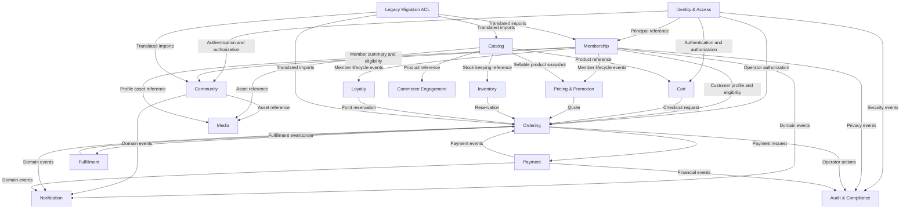
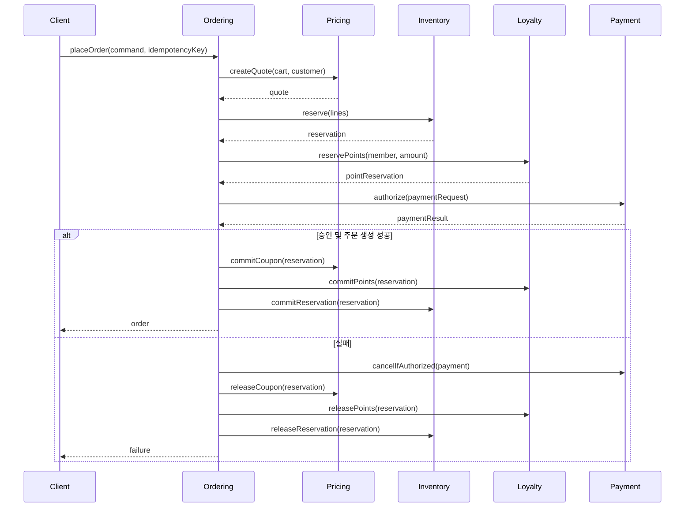

# Bounded Context 분리 제안

## 목적과 전제

이 문서는 그누보드5의 게시판, 회원관리와 영카트를 React SPA 등의 클라이언트가 사용하는 REST API 플랫폼으로 재작성하기 위한 DDD bounded context 분리안을 제안한다.

이 제안은 다음을 전제로 한다.

- 초기 시스템은 하나의 제품과 하나의 운영 조직이 관리한다.
- 웹 SPA뿐 아니라 모바일 또는 외부 클라이언트가 REST 인터페이스를 사용할 수 있다.
- 기존 그누보드·영카트 데이터는 이전 대상이지만 기존 테이블 구조를 새 도메인 모델로 유지하지 않는다.
- 초기 배포 형태는 모듈러 모놀리스다.
- bounded context는 논리적 모델과 데이터 소유권을 뜻하며, 곧바로 독립 마이크로서비스를 뜻하지 않는다.
- 멀티테넌시는 현재 확정 요구사항이 아니다. 여러 독립 사이트를 한 설치에서 운영해야 한다면 별도의 `Tenant Management` context를 추가 검토한다.

## 용어 제안

기존 그누보드는 `회원`, `사용자`, `주문자`를 대체로 같은 `mb_id`로 표현한다. 새 시스템에서는 다음 용어를 구분한다.

| 용어 | 의미 | 구분 이유 |
|---|---|---|
| `Principal` | 로그인하고 권한을 부여받는 인증 주체 | 사람 외에 관리자, 외부 앱과 시스템 계정도 표현 가능 |
| `Member` | 플랫폼에 가입하여 프로필과 회원 상태를 가진 사람 | 인증 자격증명과 회원 데이터를 분리 |
| `Customer` | 상품을 구매하는 주체 | 회원 구매자와 비회원 구매자를 모두 포함 |
| `Guest Customer` | 회원 계정 없이 주문하는 구매자 | 탈퇴 회원이나 익명 사용자와 구분 |
| `Operator` | 운영 권한을 가진 Principal | 숫자 회원 레벨과 구분 |
| `Point` | 활동 또는 구매로 적립·사용되는 플랫폼 가치 | 결제 화폐 및 쿠폰과 구분 |
| `Coupon` | 정해진 조건에서 가격을 할인하는 사용 권리 | 포인트 및 일반 가격 정책과 구분 |
| `Cart` | 구매 의사를 임시로 구성한 선택 목록 | 주문이나 재고 선점과 구분 |
| `Quote` | 특정 시각과 조건으로 계산된 예상 결제 내역 | Cart에 저장된 표시 가격과 구분 |
| `Order` | 구매자가 제출하여 보존되는 상거래 약정 | Cart와 분리 |
| `Payment` | 외부 또는 내부 결제수단의 금전 거래 | Order 상태와 분리 |
| `Fulfillment` | 주문 상품을 준비하고 전달하는 과정 | 결제와 분리 |
| `Withdrawal` | Member가 플랫폼 이용을 종료하는 행위 | 개인정보 익명화 및 주문 보존과 구분 |
| `Anonymization` | 보존 대상 관계를 유지하며 개인정보를 제거하는 행위 | Withdrawal과 별개로 실행 가능 |

`User`와 `Item`은 의미가 너무 넓으므로 도메인 용어로 사용하지 않는 편이 좋다. 인증 문맥에서는 `Principal`, 커뮤니티에서는 `Author`, 회원관리에서는 `Member`, 상거래에서는 `Customer`와 `Product`를 사용한다.

## Context Map

## 분류 요약

사업의 차별화가 커뮤니티와 커머스의 결합에 있다고 가정하면 다음과 같이 분류할 수 있다.

| 분류 | Bounded Context |
|---|---|
| Core | `Community`, `Pricing & Promotion`, `Ordering` |
| Supporting | `Membership`, `Catalog`, `Cart`, `Inventory`, `Fulfillment`, `Loyalty`, `Commerce Engagement` |
| Generic | `Identity & Access`, `Payment`, `Media`, `Notification`, `Audit & Compliance` |
| Transitional | `Legacy Migration ACL` |

사업이 게시판 플랫폼에 더 가깝다면 `Community`가 가장 중요한 core domain이고, 쇼핑몰 플랫폼에 더 가깝다면 `Ordering`과 `Pricing & Promotion`의 비중이 커진다. 이 우선순위는 구현 순서와 팀 배치에 영향을 주지만 context의 데이터 소유권은 바꾸지 않는다.

## 1. Identity & Access

### 책임

- Principal과 로그인 자격증명
- 비밀번호 및 소셜 로그인
- access session과 refresh session
- 기기별 세션 조회 및 폐기
- 역할, 권한과 리소스 범위
- 관리자와 외부 클라이언트 인증

### 소유 모델

- `Principal`
- `Credential`
- `Session`
- `ExternalIdentity`
- `Role`
- `PermissionGrant`

### 주요 명령

- `createPrincipal`
- `authenticate`
- `refreshSession`
- `revokeSession`
- `revokeAllSessions`
- `linkExternalIdentity`
- `grantPermission`
- `revokePermission`

### 주요 이벤트

- `PrincipalCreated`
- `SessionStarted`
- `SessionRevoked`
- `CredentialChanged`
- `ExternalIdentityLinked`

### 규칙

- 로그인 ID, 이메일 또는 외부 provider 식별자의 유일성을 보장한다.
- 비밀번호 변경, 차단 또는 보안 사고 시 요구된 범위의 세션을 무효화한다.
- 숫자 회원 레벨을 외부 인터페이스로 노출하지 않는다.
- 커뮤니티 및 운영 권한은 역할과 리소스 범위로 표현한다.

### 통합

`Membership`의 회원 상태를 조회하여 탈퇴·차단 회원의 신규 세션 생성을 거부한다. 다만 프로필, 동의, 포인트를 소유하지 않는다.

## 2. Membership

### 책임

- 회원가입과 회원 상태
- 회원 프로필과 주소록
- 이메일·휴대전화·실명·성인 인증 상태
- 개인정보 및 마케팅 동의 이력
- 추천인 관계
- 탈퇴와 익명화

### 소유 모델

- `Member`
- `MemberProfile`
- `MemberAddress`
- `VerificationCase`
- `MemberConsent`
- `ConsentEvent`
- `Referral`

### 주요 명령

- `registerMember`
- `changeProfile`
- `changeEmail`
- `beginVerification`
- `confirmVerification`
- `changeConsent`
- `suspendMember`
- `withdrawMember`
- `anonymizeMember`

### 주요 이벤트

- `MemberRegistered`
- `MemberVerified`
- `MemberSuspended`
- `MemberReactivated`
- `MemberWithdrawn`
- `MemberAnonymized`
- `ConsentChanged`

### 규칙

- `Member` 상태는 `ACTIVE`, `SUSPENDED`, `WITHDRAWN`, `ANONYMIZED` 중 하나다.
- Withdrawal과 Anonymization은 같은 행위가 아니다.
- 이메일 변경 시 기존 이메일 인증 상태를 그대로 승계하지 않는다.
- 본인인증 provider의 원문 응답과 플랫폼의 인증 판정을 구분한다.
- 주문과 게시글을 보존하면서 개인정보를 익명화할 수 있어야 한다.

### 통합

회원가입 완료 이벤트는 `Loyalty`의 가입 포인트와 `Pricing & Promotion`의 가입 쿠폰 발급을 유도한다. 이벤트 소비는 멱등해야 하며 회원가입 트랜잭션 안에서 다른 context 테이블을 직접 수정하지 않는다.

## 3. Community

### 책임

- 게시판과 게시판 그룹
- 게시글, 답글과 댓글
- 공지, 비밀글, 첨부파일 참조
- 추천·비추천, 스크랩과 조회 정책
- 작성·읽기 권한과 포인트 발생 조건
- 신고와 운영 조치

### 소유 모델

- `Board`
- `BoardPolicy`
- `Post`
- `Comment`
- `Reaction`
- `Bookmark`
- `ModerationCase`

### 주요 명령

- `createBoard`
- `publishPost`
- `revisePost`
- `deletePost`
- `addComment`
- `reactToPost`
- `bookmarkPost`
- `moderateContent`

### 주요 이벤트

- `PostPublished`
- `PostDeleted`
- `CommentAdded`
- `PostReacted`
- `ContentModerated`

### 규칙

- 게시판별 물리 테이블을 만들지 않고 모든 게시글은 공통 모델을 사용한다.
- 비밀글 접근 여부는 단순 공개 플래그가 아니라 작성자, 답변 관계와 운영 권한을 포함한 정책으로 판정한다.
- 게시글 작성과 조회에 따른 포인트는 Community가 금액을 직접 기록하지 않고 `Loyalty`에 이유가 포함된 이벤트를 발행한다.
- HTML 정제 정책과 원문·렌더링 결과의 책임을 명확히 한다.

## 4. Catalog

### 책임

- 카테고리와 상품 분류
- 상품, variant와 option 구성
- 상품 설명과 판매 가능 상태
- 브랜드, 제조사 및 상품 고시정보
- 상품 이미지 참조
- 관련 상품과 전시 속성

### 소유 모델

- `Category`
- `Product`
- `ProductVariant`
- `ProductOption`
- `ProductRelation`
- `ProductPublication`

### 주요 명령

- `createProduct`
- `changeProductInformation`
- `configureVariants`
- `publishProduct`
- `unpublishProduct`
- `markProductUnavailable`

### 주요 이벤트

- `ProductCreated`
- `ProductChanged`
- `ProductPublished`
- `ProductUnpublished`

### 규칙

- Catalog의 상품 가격은 기준 가격일 수 있지만 최종 결제 금액은 `Pricing & Promotion`이 계산한다.
- 재고 수량은 `Inventory`가 소유한다.
- 상품평과 상품문의는 `Commerce Engagement`가 소유한다.
- PC·모바일별 HTML 설명이나 스킨은 Catalog 도메인에 포함하지 않는다.

## 5. Pricing & Promotion

### 책임

- 상품 기준 가격과 적용 가격
- 상품, 주문 및 배송비 할인
- 쿠폰 정의, 발급, 선점과 사용
- 회원가입 쿠폰과 캠페인
- 세금과 배송비 계산 규칙
- 결제 전 Quote 생성

### 소유 모델

- `PriceBook`
- `PriceRule`
- `CouponDefinition`
- `IssuedCoupon`
- `CouponReservation`
- `Quote`
- `QuoteLine`

### 주요 명령

- `quoteCart`
- `issueCoupon`
- `reserveCoupon`
- `commitCoupon`
- `releaseCoupon`
- `configurePriceRule`

### 주요 이벤트

- `CouponIssued`
- `CouponReserved`
- `CouponConsumed`
- `CouponReleased`
- `QuoteCreated`

### 규칙

- 클라이언트가 보낸 금액을 신뢰하지 않는다.
- Quote에는 계산 시각, 유효기간, 적용 규칙과 각 할인 근거를 포함한다.
- 쿠폰의 사용, 해제와 보상은 멱등해야 한다.
- 상품 쿠폰, 주문 쿠폰과 배송비 쿠폰을 명확히 구분한다.

## 6. Cart

### 책임

- 회원 및 비회원 장바구니
- 상품 variant와 option 선택
- 수량 변경과 항목 삭제
- 바로구매용 임시 Cart
- 로그인 시 Guest Cart 인수

### 소유 모델

- `Cart`
- `CartLine`

### 주요 명령

- `createCart`
- `addCartLine`
- `changeCartLineQuantity`
- `removeCartLine`
- `claimGuestCart`
- `selectCartLinesForCheckout`

### 주요 이벤트

- `CartClaimed`
- `CartLineAdded`
- `CartExpired`

### 규칙

- Cart는 가격, 쿠폰 사용이나 재고 확보의 진실의 원천이 아니다.
- Cart에 보이는 금액은 참고값이며 checkout 시 Quote를 다시 생성한다.
- 같은 variant·option 조합의 병합 정책을 명시한다.
- guest cart claim 시 회원 Cart와의 충돌 및 중복 처리 정책을 적용한다.

## 7. Ordering

### 책임

- Checkout workflow 조정
- Customer와 수취인 snapshot
- Order와 Order Line 생성
- 주문 전체 및 항목별 상태 전이
- 취소, 부분 취소와 반품 요청
- 가격, 결제, 포인트, 쿠폰, 재고 결과의 주문 snapshot

### 소유 모델

- `Order`
- `OrderLine`
- `OrderAddressSnapshot`
- `Cancellation`
- `ReturnRequest`
- `CheckoutProcess`

### 주요 명령

- `placeOrder`
- `cancelOrder`
- `cancelOrderLines`
- `requestReturn`
- `approveReturn`
- `recordPaymentResult`
- `recordFulfillmentResult`

### 주요 이벤트

- `OrderPlaced`
- `OrderPaid`
- `OrderCancelled`
- `OrderLineCancelled`
- `ReturnRequested`
- `OrderCompleted`

### 규칙

- Order는 생성 시점의 상품명, option, 가격, 세금, 할인과 배송비를 snapshot으로 보존한다.
- Order 상태와 Order Line 상태를 분리한다.
- 상태 필드를 임의로 수정하지 않고 허용된 명령을 통해서만 전이한다.
- `placeOrder`는 같은 idempotency key로 반복 호출해도 주문을 한 번만 만든다.
- Ordering은 PG 세부 필드나 재고 테이블을 직접 다루지 않는다.

### Checkout process

Checkout은 여러 context를 조정하는 process manager로 모델링한다.

초기 모듈러 모놀리스에서는 내부 호출과 같은 데이터베이스 트랜잭션을 활용할 수 있다. Payment처럼 외부 시스템이 개입하는 부분은 로컬 트랜잭션만으로 원자성을 보장할 수 없으므로 상태가 있는 process manager와 보상 동작이 필요하다.

## 8. Payment

### 책임

- 결제 의도와 거래 상태
- 승인, 매입, 취소와 환불
- PG callback과 webhook 처리
- PG 거래와 내부 주문의 대사
- PG 요청·응답 원문과 실패 이력

### 소유 모델

- `Payment`
- `PaymentAttempt`
- `Refund`
- `ProviderEvent`
- `ReconciliationCase`

### 주요 명령

- `createPayment`
- `authorizePayment`
- `cancelPayment`
- `refundPayment`
- `acceptProviderEvent`
- `reconcilePayment`

### 주요 이벤트

- `PaymentAuthorized`
- `PaymentFailed`
- `PaymentCancelled`
- `PaymentRefunded`
- `PaymentDiscrepancyDetected`

### 규칙

- Order 상태와 Payment 상태를 동일한 필드로 표현하지 않는다.
- provider 거래번호와 callback 이벤트 ID의 유일성을 보장한다.
- 중복 callback은 성공으로 응답할 수 있지만 도메인 변화는 한 번만 발생해야 한다.
- PG별 필드와 응답 코드는 anti-corruption layer 안에서 표준 Payment 결과로 번역한다.

### 외부 adapter

- NHN KCP
- KG이니시스 및 이니시스 PRO
- 토스페이먼츠
- NICEPAY
- LG U+
- 네이버페이
- 테스트용 in-memory adapter

## 9. Inventory

### 책임

- 상품 variant별 재고
- 가용, 선점 및 확정 수량
- 재고 선점 만료
- 재고 조정과 변경 이력
- 품절 및 재입고 판정

### 소유 모델

- `StockItem`
- `StockReservation`
- `StockMovement`

### 주요 명령

- `reserveStock`
- `commitReservation`
- `releaseReservation`
- `adjustStock`

### 주요 이벤트

- `StockReserved`
- `StockReservationExpired`
- `StockCommitted`
- `StockReleased`
- `ProductOutOfStock`
- `ProductRestocked`

### 규칙

- 가용 수량은 보유 수량에서 활성 선점 수량을 제외한 값이다.
- 같은 주문 항목에 대한 재고 확정과 해제는 멱등해야 한다.
- 배송 상태로 바꿀 때 처음 재고를 차감하는 기존 의미는 checkout 선점과 fulfillment 확정으로 재정의한다.

## 10. Fulfillment

### 책임

- 상품 준비와 출고
- 배송 묶음과 분할 배송
- 택배사, 송장과 배송 상태
- 배송 완료
- 반품 회수

### 소유 모델

- `FulfillmentOrder`
- `Shipment`
- `ShipmentLine`
- `TrackingInformation`
- `ReturnShipment`

### 주요 명령

- `prepareOrder`
- `createShipment`
- `ship`
- `recordDelivery`
- `receiveReturn`

### 주요 이벤트

- `FulfillmentStarted`
- `ShipmentCreated`
- `OrderShipped`
- `OrderDelivered`
- `ReturnReceived`

### 규칙

- 하나의 Order를 여러 Shipment로 분할할 수 있다.
- 배송 상태와 Order 결제 상태를 직접 결합하지 않는다.
- 외부 배송 추적 상태는 내부 상태로 번역한다.

## 11. Loyalty

### 책임

- 포인트 계정과 원장
- 적립, 사용, 선점, 해제와 만료
- 회원가입, 추천, 로그인, 커뮤니티 활동 및 구매 완료 보상
- 잔액 projection

### 소유 모델

- `PointAccount`
- `PointEntry`
- `PointReservation`
- `PointExpiration`

### 주요 명령

- `grantPoints`
- `reservePoints`
- `commitPoints`
- `releasePoints`
- `expirePoints`
- `reversePointEntry`

### 주요 이벤트

- `PointsGranted`
- `PointsReserved`
- `PointsConsumed`
- `PointsReleased`
- `PointsExpired`

### 규칙

- Point Ledger가 진실의 원천이며 잔액은 projection이다.
- 잔액은 음수가 될 수 없다.
- source context, source ID와 action을 조합한 idempotency key를 사용한다.
- 취소는 기존 원장 행을 삭제하지 않고 반대 방향의 보상 행을 추가한다.

## 12. Commerce Engagement

### 책임

- 상품평과 평점
- 상품문의와 답변
- 비밀문의 접근
- 찜 목록
- 재입고 알림 신청

### 소유 모델

- `ProductReview`
- `ProductInquiry`
- `Wishlist`
- `BackInStockSubscription`

### 주요 명령

- `writeReview`
- `answerInquiry`
- `addToWishlist`
- `subscribeBackInStock`

### 주요 이벤트

- `ReviewPublished`
- `ProductInquiryCreated`
- `ProductInquiryAnswered`
- `BackInStockRequested`

### 규칙

- 상품평 작성 가능 여부는 Ordering이 제공하는 구매 사실을 사용하지만 주문 데이터를 직접 조회하지 않는다.
- 평점 집계는 review 이벤트로 갱신되는 projection으로 관리한다.
- 비밀문의는 작성자와 허용된 Operator만 조회할 수 있다.

## 13. Media

### 책임

- 업로드 요청과 파일 메타데이터
- 이미지 검사와 변환
- 저장소 위치와 공개 범위
- 바이러스 또는 유해 파일 검사
- profile, post와 product asset 제공

### 소유 모델

- `Asset`
- `UploadIntent`
- `AssetVariant`

### 규칙

- 다른 context는 파일 경로나 버킷 이름 대신 `AssetId`만 보관한다.
- 업로드 완료 전 파일을 게시글이나 상품에 연결하지 않는다.
- 공개, 회원 전용 및 소유자 전용 asset을 구분한다.

## 14. Notification

### 책임

- 이메일, SMS, 앱 push와 webhook 전송
- template과 채널 선택
- 재시도와 실패 관리
- 회원 수신 동의와 발송 목적 반영

### 소유 모델

- `NotificationRequest`
- `DeliveryAttempt`
- `NotificationTemplate`

### 규칙

- 회원가입이나 주문 트랜잭션 안에서 외부 메일·SMS를 직접 호출하지 않는다.
- domain event를 outbox로 전달받아 비동기로 전송한다.
- 광고성 알림과 거래성 알림의 동의 정책을 구분한다.

## 15. Audit & Compliance

### 책임

- 운영자 변경 이력
- 인증 및 권한 보안 이벤트
- 개인정보 접근과 익명화 이력
- 결제·환불 감사 이력
- 법적 보존정책

### 규칙

- 감사로그는 업무 테이블의 메모 필드와 분리한다.
- append-only 저장을 기본으로 한다.
- 민감한 원문 payload에는 암호화와 보존기간을 적용한다.

관리자 화면 자체는 bounded context가 아니다. 관리자 SPA와 관리자 REST adapter는 각 context가 제공하는 운영 명령과 조회 모델을 사용한다.

## 16. Legacy Migration ACL

### 책임

- 기존 그누보드와 영카트 스키마 읽기
- 기존 용어와 상태를 새 모델로 번역
- 데이터 품질 오류 탐지와 보정 보고
- 비밀번호 해시의 점진적 전환
- 이전 결과와 재실행 이력

### 주요 번역

| 기존 모델 | 새 모델 |
|---|---|
| `g5_member.mb_id` | `Principal.loginId` 및 `Member.legacyId` |
| `mb_level` | Role과 PermissionGrant |
| `mb_leave_date` | `MemberStatus.WITHDRAWN` |
| `mb_intercept_date` | `MemberStatus.SUSPENDED` |
| `g5_point` | `PointEntry` |
| `g5_shop_cart`의 쇼핑 행 | `CartLine` |
| `g5_shop_cart`의 주문 이후 행 | `OrderLine` |
| `g5_shop_order` | `Order`와 Payment reference |
| 한글 주문 상태 | 새 Order 및 Fulfillment 상태 코드 |
| `mb_agree_log` | `ConsentEvent` 목록 |

Legacy Migration은 영구적인 업무 context가 아니라 전환 기간의 anti-corruption layer다. 새 코드가 기존 테이블 명칭과 상태 문자열을 직접 사용하지 못하게 차단한다.

## Context 간 통합 원칙

### 데이터 소유권

- 한 context의 테이블은 해당 context만 쓴다.
- 다른 context는 안정적인 식별자와 필요한 snapshot만 보관한다.
- context 간 데이터베이스 JOIN을 REST 계약이나 도메인 규칙의 기본 수단으로 사용하지 않는다.
- 화면용 통합 조회는 별도의 read model 또는 query layer에서 구성한다.

### 동기 호출

즉시 성공·실패 판단이 필요한 다음 작업에 제한한다.

- 권한 확인
- Quote 생성
- checkout 시 재고·포인트·쿠폰 선점
- 결제 승인 요청

초기 모듈러 모놀리스에서는 네트워크 호출이 아니라 in-process 인터페이스로 구현한다.

### 비동기 이벤트

후속 처리가 원 요청의 성공 조건이 아닌 작업에 사용한다.

- 이메일과 SMS 발송
- 검색 인덱스 갱신
- 분석 이벤트
- 가입 포인트 또는 가입 쿠폰 지급
- 상품평점 projection 갱신
- 감사로그 복제

이벤트는 outbox를 통해 발행하고 소비자는 idempotency key로 중복을 처리한다.

### Snapshot

다음 정보는 원본의 현재 상태를 참조하지 않고 발생 당시 snapshot을 보존한다.

- Order의 상품명, option, 가격, 세금과 할인
- 주문자 및 수취인 정보
- Payment의 provider 요청과 결과
- Consent의 정책 버전과 문구 식별자
- 운영자 조치 당시의 actor와 대상 상태

## 권장 배포 구조

bounded context 15개를 처음부터 15개 마이크로서비스로 배포하지 않는다. 초기에는 다음 네 그룹을 한 애플리케이션과 한 데이터베이스 클러스터 안의 독립 schema 또는 명확한 table ownership으로 구현하는 것을 권장한다.

```mermaid
flowchart LR
    subgraph Platform[Platform Core]
        IAM[Identity & Access]
        MEMBER[Membership]
        COMMUNITY[Community]
    end

    subgraph Commerce[Commerce Core]
        CATALOG[Catalog]
        PRICING[Pricing & Promotion]
        CART[Cart]
        ORDERING[Ordering]
        INVENTORY[Inventory]
        ENGAGEMENT[Commerce Engagement]
    end

    subgraph Operations[Commerce Operations]
        PAYMENT[Payment]
        FULFILLMENT[Fulfillment]
        LOYALTY[Loyalty]
    end

    subgraph Shared[Supporting Capabilities]
        MEDIA[Media]
        NOTIFY[Notification]
        AUDIT[Audit & Compliance]
    end

    Platform --> Commerce
    Commerce --> Operations
    Platform --> Shared
    Commerce --> Shared
    Operations --> Shared
```

독립 배포는 다음 조건이 실제로 발생했을 때 검토한다.

- context별 배포 주기와 장애 격리 요구가 크게 다름
- 서로 다른 팀이 독립적으로 소유함
- 확장 요구가 뚜렷하게 다름
- 네트워크 지연과 eventual consistency 비용을 감당할 이유가 있음

Payment와 Notification은 외부 연동 및 재시도 특성 때문에 가장 먼저 별도 worker 또는 배포 단위로 분리될 가능성이 높다.

## 검증해야 할 시나리오

context seam은 다음 구체적 시나리오를 통과해야 한다.

### Guest Cart 인수

비회원이 상품 A를 담은 뒤, 이미 상품 A를 가진 회원 계정으로 로그인한다. `Cart`는 수량 상한과 option 일치 여부를 확인하여 병합하고, 가격과 재고는 확정하지 않는다.

### Quote 이후 가격 변경

고객이 Quote를 본 뒤 checkout 전에 상품 가격이 변경된다. Ordering은 Quote 유효기간과 정책에 따라 기존 가격을 보장하거나 새 Quote를 요구해야 한다. 클라이언트가 이전 금액을 강제할 수 없어야 한다.

### 결제 승인 후 주문 저장 실패

PG 승인은 성공했지만 주문 저장이 실패한다. Payment 취소 요청, 재시도 상태와 수동 대사 대상을 기록해야 하며 단순 HTTP 500으로 끝나면 안 된다.

### 중복 PG callback

같은 거래 callback이 동시에 두 번 도착한다. Payment 이벤트는 한 번만 반영하고 두 요청 모두 provider가 요구하는 정상 응답을 받을 수 있어야 한다.

### 포인트와 쿠폰 동시 사용

같은 회원이 두 탭에서 동일한 포인트 잔액과 쿠폰으로 주문한다. 선점과 유일한 idempotency key로 한도를 넘는 사용을 막아야 한다.

### 부분 취소

세 개의 Order Line 중 하나만 취소한다. 할인, 배송비, 세금, 포인트, 쿠폰과 환불 금액의 재배분 책임이 어느 context에 있는지 명확해야 한다. Ordering이 취소 대상을 정하고 Pricing이 금액을 계산하며 Payment가 환불을 실행하는 구성이 적합하다.

### 배송 중 회원 탈퇴

회원이 주문 배송 중 탈퇴한다. Membership은 회원 접근을 종료하지만 Ordering과 Fulfillment는 법적 보존이 필요한 주문 snapshot으로 배송을 완료해야 한다.

### 게시글 보유 회원 익명화

회원 개인정보를 익명화해도 Community의 게시글과 댓글 식별 관계는 유지한다. 공개 작성자 표시는 정책에 따라 `탈퇴 회원` 등으로 projection한다.

## 우선 구현 순서

1. `Legacy Migration ACL`로 기존 데이터와 상태 의미를 문서화하고 characterization test를 만든다.
2. `Identity & Access`, `Membership`, `Authorization`을 구현한다.
3. `Community`의 읽기와 쓰기 흐름을 구현해 플랫폼 기본 기능을 연다.
4. `Loyalty`를 원장 중심으로 구현한다.
5. `Catalog`, `Pricing & Promotion`, `Cart`를 구현한다.
6. `Inventory` 선점과 `Ordering` checkout process를 구현한다.
7. `Payment` adapter와 callback idempotency를 구현한다.
8. `Fulfillment`, 취소, 환불과 반품을 구현한다.
9. `Commerce Engagement`, `Notification`, `Media`, `Audit & Compliance`를 완성한다.

## 확정이 필요한 정책

다음 결정은 데이터 모델과 context interface에 큰 영향을 주므로 구현 전에 확정해야 한다.

- 플랫폼이 단일 사이트인지 멀티테넌트인지
- 비회원 주문을 계속 지원할지
- 기존 게시판 회원 레벨을 완전히 폐기할지 호환할지
- 가격 변경 시 Quote를 일정 시간 보장할지
- 결제 시점에 재고를 선점할지, 승인 후 선점할지
- 부분 취소 시 쿠폰과 배송비를 어떻게 재배분할지
- 주문 완료와 구매확정의 의미를 분리할지
- 포인트 적립 기준을 배송 완료로 할지 구매확정으로 할지
- 탈퇴 후 게시글 작성자 표시와 주문 개인정보 보존기간
- 기존 소셜 로그인과 PG provider를 모두 이전할지

## 최종 제안

권장 구조는 15개 bounded context를 가진 모듈러 모놀리스다. 이 중 REST endpoint를 중심으로 코드를 나누지 않고, 각 context가 자신의 모델과 쓰기 데이터만 소유하도록 한다.

가장 중요한 seam은 다음 네 곳이다.

1. `Identity & Access`와 `Membership`: 인증 주체와 회원 프로필·상태의 분리
2. `Cart`와 `Ordering`: 구매 의사와 보존되는 주문 약정의 분리
3. `Ordering`과 `Payment`: 주문 상태와 외부 금전 거래 상태의 분리
4. `Ordering`과 `Inventory`·`Loyalty`·`Pricing & Promotion`: checkout process와 각 자원의 소유권 분리

이 구조를 따르면 기존 영카트 주문 처리 파일에 섞여 있던 가격, 쿠폰, 포인트, 재고, 결제와 복구 규칙을 각 context에 집중시키면서도, Ordering이 하나의 작은 인터페이스로 전체 checkout을 조정할 수 있다.
