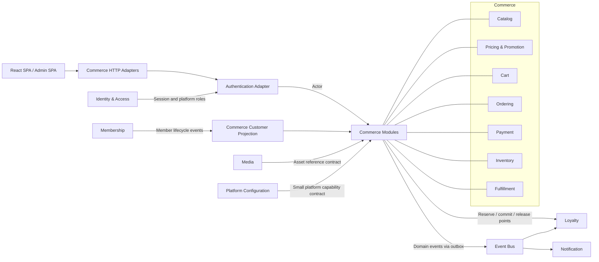
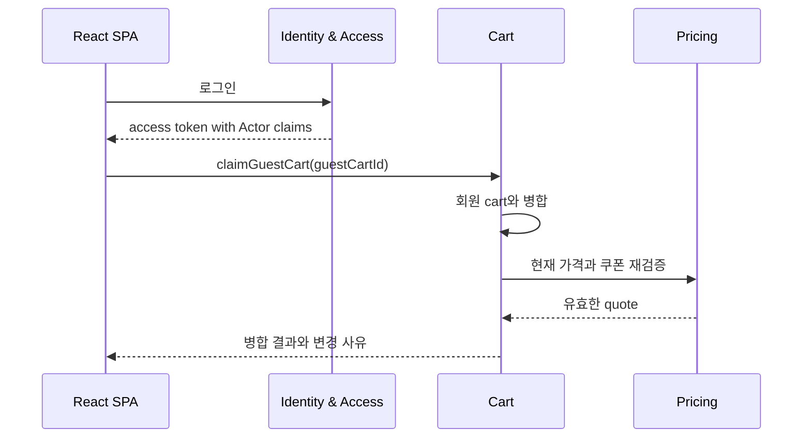
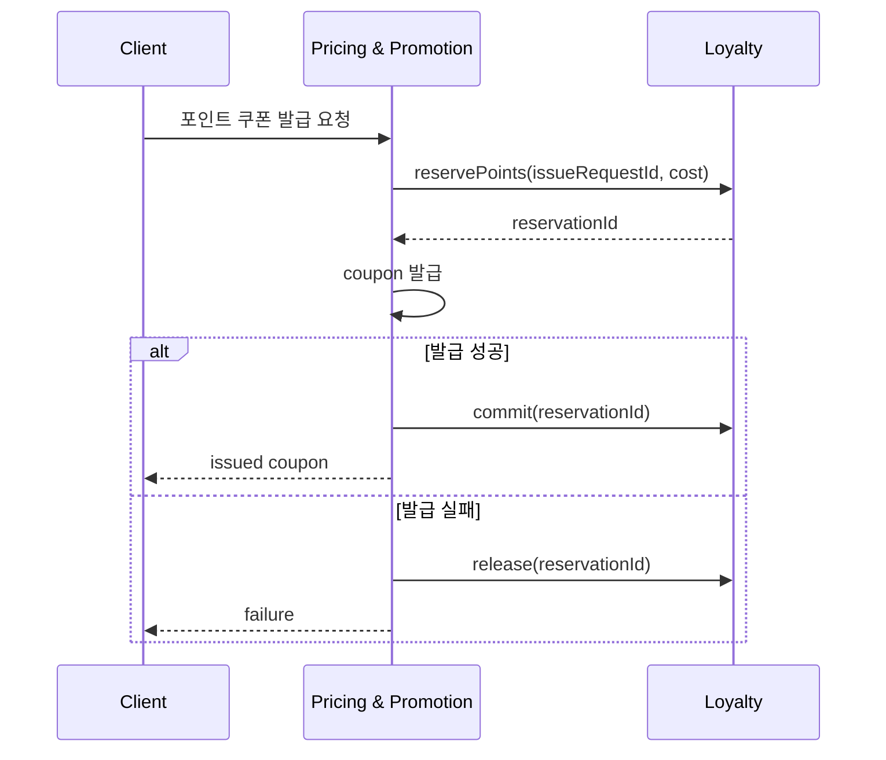
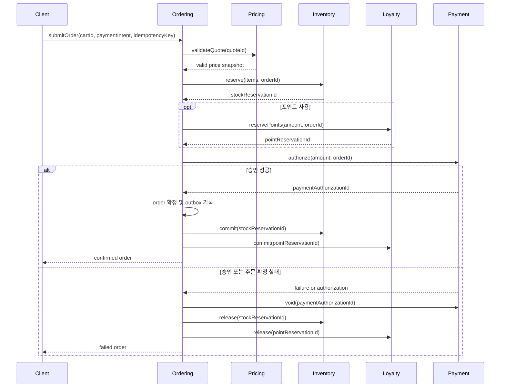
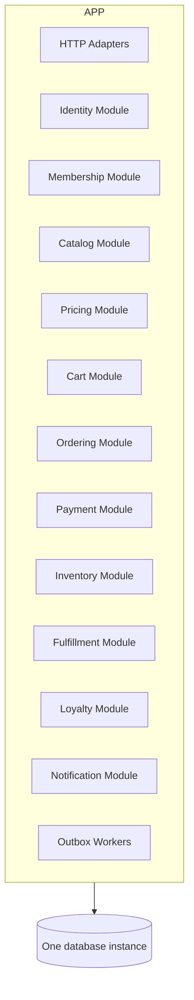

# 쇼핑몰과 공통 기능의 느슨한 연결 제안

## 결론

그누보드5의 영카트는 상품·장바구니·주문 같은 쇼핑몰 기능 자체보다 회원 전역 객체, 숫자 회원 레벨, 전역 설정과 공용 포인트 함수에 강하게 의존한다. 이를 단순히 REST 호출로 치환하면 데이터베이스 결합이 네트워크 결합으로 바뀔 뿐이다.

권장 방향은 다음과 같다.

- 인증 결과를 요청 단위의 작은 `Actor` 값으로 쇼핑몰에 전달한다.
- 쇼핑몰의 구매자 개념인 `Customer`를 플랫폼 `Member`와 분리한다.
- 회원 상태 중 구매 판정에 필요한 사실만 쇼핑몰의 로컬 projection으로 유지한다.
- 권한은 Identity & Access가 인증과 플랫폼 역할을, 각 Commerce context가 자원 접근 정책을 소유한다.
- 거대한 공용 `Settings`를 만들지 않고 설정의 의미를 소유하는 bounded context에 타입이 있는 정책으로 배치한다.
- 포인트 조회·차감은 `Loyalty`의 원장과 예약 계약을 사용하고, 적립은 주문 이벤트로 연결한다.
- 주문 처리에는 동기 예약과 보상 흐름이 필요하고, 알림·적립·분석은 outbox 이벤트로 분리한다.
- 초기에는 별도 프로세스가 아니라 모듈러 모놀리스로 구현하되, 코드와 데이터 소유권 경계를 강제한다.

## 조사 범위

이 문서에서 **쇼핑몰**은 다음 bounded context를 뜻한다.

- `Catalog`
- `Pricing & Promotion`
- `Cart`
- `Ordering`
- `Payment`
- `Inventory`
- `Fulfillment`

**공통 기능**은 여러 업무 영역에서 재사용되지만 쇼핑몰의 일부는 아닌 다음 기능을 뜻한다.

- `Identity & Access`
- `Membership`
- `Loyalty`
- `Notification`
- `Media`
- 최소 범위의 `Platform Configuration`

`React SPA`, 관리자 화면과 모바일 앱은 bounded context가 아니라 각 context를 사용하는 전달 채널 또는 adapter다.

## 현재 결합의 근거

| 결합 대상 | 현재 구현 사례 | 결과 |
|---|---|---|
| 회원·세션 | 로그인 처리 중 영카트의 `cart_item_clean()`과 `set_cart_id()`를 직접 호출 (`bbs/login_check.php`) | Membership의 로그인 흐름이 Cart의 내부 동작을 알아야 함 |
| 회원 상태 | 판매 가능 여부를 `$member['mb_level']`과 `$default['de_level_sell']`로 비교 (`shop/cartupdate.php`, `shop/ajax.action.php`) | 구매 정책이 회원 컬럼과 전역 설정 표현에 종속됨 |
| 본인·성인 인증 | 상품·카테고리 처리에서 회원 인증 컬럼을 읽고 BBS 회원 인증 화면으로 redirect (`lib/shop.lib.php`) | Catalog/Ordering가 Membership UI와 데이터 구조에 결합됨 |
| 관리자 권한 | 쇼핑몰 관리 파일이 공통 `$auth`, `$sub_menu`, `auth_check_menu()`를 직접 사용 (`adm/shop_admin/*.php`) | Commerce의 업무 권한과 플랫폼 메뉴 권한이 혼합됨 |
| 회원 조회 | 주문·쿠폰·문의 관리 SQL이 회원 테이블을 직접 JOIN | 한 context의 스키마 변경이 다른 context로 전파됨 |
| 가입 혜택 | 회원가입 완료 코드가 영카트 가입 쿠폰을 직접 발급 (`bbs/register_form_update.php`) | Membership이 Promotion의 발급 규칙을 소유하게 됨 |
| 포인트 결제 | 주문 코드가 `get_point_sum()`과 `insert_point()`를 호출하고 회원 단위 DB lock을 획득 (`shop/orderformupdate.php`) | Ordering가 Loyalty의 저장·동시성·보상 방식을 알아야 함 |
| 포인트 적립·복원 | 주문 완료, 취소, 상태 변경 코드가 곳곳에서 `insert_point()` 호출 | 주문 상태와 원장 상태의 일관성 규칙이 분산됨 |
| 포인트 쿠폰 | 쿠폰 다운로드가 잔액을 확인하고 포인트를 직접 차감 (`shop/ajax.coupondownload.php`) | Promotion과 Loyalty의 실패 복구 경계가 없음 |
| 설정 | `$default`가 결제사 자격증명, 판매 레벨, 배송, 포인트, UI/스킨까지 포함 | 의미·보안·변경 주기가 다른 설정이 하나의 전역 구조에 섞임 |
| 알림 | 주문 처리 중 메일·SMS include를 직접 실행 | 외부 채널 장애가 주문 처리에 전파됨 |

현재 코드는 회원 단위 `GET_LOCK`과 결제 취소·장바구니 복구 같은 보상 처리를 추가해 포인트 동시 주문을 방어한다. 이는 포인트 차감이 단순 부가 기능이 아니라 결제 완료 여부를 결정하는 강한 일관성 작업임을 보여준다. 새 구조에서도 이 규칙을 비동기 이벤트 하나로 약화하면 안 된다.

## 목표 Context Map



화살표는 코드 공유가 아니라 명시적 계약을 뜻한다. 같은 PHP 프로세스에서 시작하더라도 상대 context의 테이블, 전역 변수와 내부 entity를 직접 참조하지 않는다.

## 핵심 용어

| 용어 | 의미 | 소유자 |
|---|---|---|
| `Principal` | 인증 수단에 대응하는 보안 주체 | Identity & Access |
| `Actor` | 현재 요청의 인증 결과와 최소 플랫폼 역할을 담은 불변값 | HTTP/Auth adapter가 생성 |
| `Member` | 가입, 프로필, 상태, 본인인증을 관리하는 플랫폼 회원 | Membership |
| `Customer` | 상품을 장바구니에 담고 주문하는 구매자. 비회원일 수도 있음 | Commerce |
| `CommerceCustomerProjection` | 구매 판정에 필요한 회원 사실의 로컬 읽기 모델 | Commerce |
| `OrderCustomerSnapshot` | 주문 시점의 구매자·수령 정보를 보존하는 값 | Ordering |
| `PointAccount` | 포인트 잔액과 거래 원장을 관리하는 계정 | Loyalty |

가장 중요한 분리는 `Member`와 `Customer`다. 회원가입 시스템이 없어도 비회원 구매자는 존재할 수 있고, 회원 탈퇴 후에도 법적·회계상 주문은 유지돼야 한다. 따라서 주문이 회원 entity의 생명주기에 종속되면 안 된다.

## 1. 회원과 쇼핑몰 분리

### 요청 시에는 `Actor`만 전달

인증 adapter는 토큰 또는 세션을 검증하고 다음과 같은 작은 값을 application service에 넘긴다.

```text
Actor
  principalId
  memberId?
  platformRoles
  authenticatedAt
```

쇼핑몰 명령은 전역 `$member`나 회원 레코드 전체를 받지 않는다. 이메일, 주소, 포인트 잔액처럼 해당 작업에 필요하지 않은 필드도 포함하지 않는다.

### 구매 판정은 로컬 projection 사용

Membership은 다음과 같은 lifecycle event를 발행한다.

- `MemberRegistered`
- `MemberActivated`
- `MemberVerified`
- `MemberSuspended`
- `MemberReinstated`
- `MemberWithdrawn`
- `MemberAnonymized`

Commerce는 이벤트를 받아 자신의 `CommerceCustomerProjection`을 갱신한다.

```text
CommerceCustomerProjection
  memberId
  status
  identityVerified
  adultVerified
  customerSegmentIds
  sourceVersion
  updatedAt
```

`customerSegmentIds`는 가격·쿠폰 정책에 정말 필요한 경우에만 둔다. 기존 `mb_level` 숫자를 그대로 복제하지 말고 `WHOLESALE`, `VIP`, `EMPLOYEE`처럼 업무 의미가 있는 segment 또는 entitlement로 번역한다.

projection이 약간 늦을 수 있으므로 상태별 허용 지연을 정한다.

| 판정 | 권장 방식 |
|---|---|
| 상품 표시·일반 가격 노출 | 로컬 projection |
| 장바구니 추가 | 로컬 projection |
| 성인 상품 접근 | 짧은 TTL의 검증 사실 또는 서명된 claim |
| 최종 주문 제출 | 로컬 projection의 버전·갱신 시각 검사, 고위험이면 Membership에 최신 상태 확인 |
| 기존 주문 조회 | Actor와 Ordering 소유권 정책으로 판정 |

### 주문은 snapshot을 소유

주문 생성 시 `memberId`만 참조하고, 주문 이행에 필요한 구매자명, 연락처, 배송지는 `OrderCustomerSnapshot`과 `ShippingAddressSnapshot`으로 복사한다. 이후 회원이 주소를 변경하거나 탈퇴해도 과거 주문은 변하지 않는다.

개인정보 보존 기간이 끝나면 Membership 삭제를 전파하는 대신 Ordering가 자신의 법적 보존 정책에 따라 주문 snapshot을 익명화한다.

### 로그인과 장바구니 연결

현재는 로그인 코드가 영카트 함수를 직접 호출한다. 새 구조에서는 로그인 성공이 Cart 내부 함수를 호출하지 않는다.

권장 흐름은 다음 둘 중 하나다.

1. SPA가 로그인 전 guest cart token을 보관하고 로그인 후 `POST /carts/{guestCartId}/claim`을 명시적으로 호출한다.
2. 인증 완료 orchestration이 `UserAuthenticated`를 받고 Cart application port의 `claimGuestCart()`를 호출한다.

첫 번째가 흐름과 실패를 사용자에게 설명하기 쉬워 기본 권장안이다. 충돌 시에는 다음 정책을 Cart가 소유한다.

- 동일 상품 수량 합산 또는 분리
- 쿠폰 재검증
- 재고·판매 상태 재검증
- 가격 재산정
- guest cart 폐기 시점

Membership은 이 규칙을 알지 않는다.



## 2. 권한 분리

권한을 전부 중앙 권한 서비스의 역할명으로 표현하면 쇼핑몰 규칙이 다시 IAM에 흡수된다. 인증과 업무 인가를 나눈다.

### Identity & Access 소유

- 로그인과 로그아웃
- 토큰·세션 수명
- credential과 MFA
- 플랫폼 운영자 같은 전역 역할
- 계정 폐기와 세션 철회

### Commerce context 소유

- `Ordering`: 주문자 본인 조회·취소, 상담원 조회·변경 범위
- `Catalog`: 상품 등록·공개·판매 중지 권한
- `Pricing & Promotion`: 가격과 쿠폰 생성·승인 권한
- `Inventory`: 재고 조정 권한
- `Fulfillment`: 출고·배송·반품 처리 권한

각 context는 `Actor`와 자신이 소유한 resource를 입력받는 정책을 제공한다.

```text
OrderAccessPolicy.canView(actor, order)
OrderAccessPolicy.canCancel(actor, order)
CatalogOperationPolicy.canPublish(actor, catalogScope)
PromotionOperationPolicy.canApprove(actor, campaign)
InventoryOperationPolicy.canAdjust(actor, warehouse)
```

관리자 SPA의 메뉴 코드는 이러한 capability를 표시하는 adapter일 뿐, 권한의 원본이 아니다. 서버는 모든 명령에서 정책을 다시 판정한다.

## 3. 설정 분리

`Settings`라는 하나의 공통 bounded context와 범용 key-value API를 만드는 것은 권장하지 않는다. 전역 `$default`가 가진 결합을 HTTP API로 옮기게 되기 때문이다.

| 기존 설정의 의미 | 목표 소유자 | 목표 표현 |
|---|---|---|
| 판매 가능 상품·노출 규칙 | Catalog | `CatalogPublicationPolicy` |
| 가격, 세금, 할인, 쿠폰 규칙 | Pricing & Promotion | `PricingPolicy`, `PromotionPolicy` |
| 장바구니 보존·병합 규칙 | Cart | `CartRetentionPolicy`, `CartMergePolicy` |
| 최소 주문액, 주문 취소 가능 상태 | Ordering | `CheckoutPolicy`, `CancellationPolicy` |
| 재고 차감·예약 만료 | Inventory | `ReservationPolicy` |
| 배송비, 무료 배송, 배송 지역 | Fulfillment 또는 Pricing | `ShippingPolicy` |
| 사용 가능 결제수단 | Payment | `PaymentMethodPolicy` |
| PG merchant ID와 비밀키 | Payment infrastructure adapter | secret manager 참조 |
| 포인트 사용 최소액·상한·적립 | Loyalty | `PointUsagePolicy`, `PointEarningPolicy` |
| 메일·SMS provider와 template | Notification | `ChannelPolicy`, `TemplateId` |
| 사이트명·공개 URL·공통 기능 flag | Platform Configuration | 작은 `PlatformCapabilities` |
| 스킨, 화면 배치, 노출 문구 | React SPA 또는 CMS | client configuration |

설정 변경은 의미 있는 명령으로 수행하고 version을 부여한다.

```text
changeMinimumOrderAmount(amount)
changePointSpendingLimit(limit)
enablePaymentMethod(method)
changeInventoryReservationTtl(duration)
```

주문 견적에는 적용한 정책 version을 기록한다. 결제 도중 설정이 바뀌어도 이미 승인된 quote의 유효기간 안에서는 동일한 금액과 조건을 재현할 수 있어야 한다.

PG 비밀키는 일반 설정 조회 API나 프론트엔드 capability 응답에 포함하지 않는다. Payment adapter만 secret reference를 해석한다.

## 4. 포인트 분리

### 원장과 잔액의 소유권

`Loyalty`가 포인트 원장과 사용 가능 잔액의 유일한 원본이다. Membership의 회원 레코드에 포인트 잔액을 두지 않는다. 화면용 잔액 projection을 캐시할 수 있지만 원장과 불일치할 때 결제를 승인하는 근거로 사용하지 않는다.

```text
PointTransaction
  transactionId
  accountId
  type: GRANT | RESERVE | COMMIT | RELEASE | EXPIRE | REVERSE
  amount
  referenceType
  referenceId
  idempotencyKey
  occurredAt
```

### 차감은 동기 예약 계약

포인트는 결제 수단의 일부이므로 주문 완료 전에 사용 가능성을 확정해야 한다.

```text
reservePoints(accountId, amount, orderId, idempotencyKey)
commitPointReservation(reservationId, idempotencyKey)
releasePointReservation(reservationId, reason, idempotencyKey)
```

예약은 TTL을 가지며 동일 idempotency key 재호출은 같은 결과를 반환한다. Ordering는 포인트 원장 테이블이나 lock 구현을 알지 않는다.

### 적립은 주문 이벤트

포인트 적립은 주문 완료 트랜잭션의 선행 조건이 아니므로 outbox event로 처리한다.

- `OrderCompleted` 또는 제품 정책에 따라 `PurchaseConfirmed`
- Loyalty가 `PointsGranted` 처리
- 주문 취소·반품 시 `OrderCancelled`, `ReturnCompleted`
- Loyalty가 기존 거래 reference를 찾아 `PointsReversed` 처리

중복 이벤트는 `orderId + policyVersion + earningType` 같은 idempotency key로 한 번만 반영한다.

### 포인트로 쿠폰 구매

현재의 포인트 차감형 쿠폰 다운로드를 유지한다면 Promotion과 Loyalty 사이에 작은 process manager가 필요하다.



## 5. 주문 처리의 일관성 경계

모든 모듈이 한 DB transaction을 공유하면 구현은 쉬워 보이지만 context별 소유권이 무너진다. 반대로 모든 단계를 비동기로 만들면 사용자는 돈이 결제됐지만 주문이 없는 상태를 오래 볼 수 있다.

Checkout에는 짧은 동기 orchestration과 명시적 보상을 사용한다.



Ordering의 process manager는 각 단계의 ID와 상태를 저장한다. 재시도는 같은 idempotency key를 사용한다. 보상 자체가 실패할 수 있으므로 `COMPENSATION_PENDING` 상태와 운영자 재처리 도구가 필요하다.

## 6. 알림과 미디어 분리

### Notification

주문 확정 transaction에서 메일이나 SMS를 직접 보내지 않는다. Ordering가 주문과 outbox event를 같은 transaction에 기록하고 Notification이 구독한다.

- `OrderPlaced`
- `PaymentCompleted`
- `ShipmentDispatched`
- `OrderCancelled`
- `ReturnCompleted`

Notification은 채널 재시도와 template을 소유한다. 전송 실패가 주문을 취소시키지 않는다.

### Media

Catalog는 파일 경로나 업로드 구현 대신 `AssetId`와 공개 metadata만 저장한다. Media가 업로드, 바이러스 검사, 변환, 삭제 정책을 소유한다. 상품 공개 전에 필요한 asset 상태는 동기 조회보다 `AssetReady` projection으로 유지할 수 있다.

## 상호작용 원칙

| 상호작용 | 방식 | 이유 |
|---|---|---|
| 요청자 인증 | 요청 시작 시 동기 검증 후 `Actor` 전달 | 모든 명령의 신뢰 경계 |
| 구매 가능 회원 상태 | Commerce 로컬 projection | 조회마다 Membership 장애가 전파되지 않음 |
| 고위험 최종 상태 확인 | 제한적인 동기 port | 정지·성인 인증의 최신성이 필수일 때만 사용 |
| guest cart 귀속 | 명시적 Cart command | 병합 규칙과 실패를 Cart가 소유 |
| 가격 계산 | Checkout 중 동기 호출 또는 동일 프로세스 port | 주문 금액을 즉시 확정해야 함 |
| 재고 확보 | 동기 reserve/commit/release | 초과 판매 방지 |
| 포인트 사용 | 동기 reserve/commit/release | 결제 금액과 잔액의 강한 일관성 |
| 포인트 적립·회수 | outbox event | 주문 완료의 선행 조건이 아님 |
| 메일·SMS | outbox event | 외부 채널 장애 격리 |
| 업무 설정 | context 내부 typed policy | 범용 설정 스키마 결합 방지 |

## 데이터 소유권

| 데이터 | 유일한 쓰기 소유자 | 다른 context의 사용 방식 |
|---|---|---|
| credential, session, global role | Identity & Access | `Actor` claim |
| 회원 프로필·상태·검증 | Membership | lifecycle event와 최소 projection |
| 상품·카테고리 | Catalog | ID 또는 published catalog view |
| 가격·쿠폰·campaign | Pricing & Promotion | quote와 promotion command |
| 장바구니 | Cart | cart command/API |
| 주문·주문 snapshot | Ordering | order event/API |
| 결제 거래 | Payment | authorize/capture/refund port |
| 재고·예약 | Inventory | reserve/commit/release port |
| 배송·반품 | Fulfillment | fulfillment command/event |
| 포인트 원장·잔액 | Loyalty | reservation port와 event |
| 메시지 발송 내역 | Notification | domain event 구독 |
| 파일 원본·변환 상태 | Media | `AssetId`, asset event |

금지할 의존성은 다음과 같다.

- 다른 context 테이블에 `INSERT`, `UPDATE`, `DELETE`
- application query에서 다른 context 테이블 JOIN
- 다른 context의 ORM entity 또는 PHP 배열을 그대로 공유
- 공통 `helpers.php`에 업무 규칙 추가
- context를 건너뛰어 PG, SMS, 파일 시스템 SDK를 직접 호출
- SPA가 여러 context 응답을 조합해 서버의 핵심 주문 규칙을 결정

## 배포 구조

처음부터 마이크로서비스로 쪼개는 것은 권장하지 않는다. 기존 영카트의 주문 흐름은 가격, 쿠폰, 포인트, 결제, 재고와 강한 일관성을 요구한다. 네트워크 경계까지 동시에 도입하면 분산 실패 처리 부담이 급격히 커진다.

권장 초기 구조는 모듈러 모놀리스다.



한 DB instance를 쓰더라도 schema 또는 table prefix, repository와 DB 권한으로 쓰기 소유권을 분리한다. 모듈 간 호출은 public application interface를 통해서만 한다. 이후 다음 조건이 충족될 때 일부 모듈을 별도 서비스로 추출한다.

- 독립 배포가 실제 운영 병목을 해결함
- 트래픽과 확장 패턴이 뚜렷하게 다름
- 팀 소유권이 분리됨
- 계약 테스트와 outbox/inbox 운영 경험이 쌓임
- 분산 장애와 관측 비용을 감당할 수 있음

## REST API 경계 예시

REST resource는 데이터베이스 테이블을 노출하지 않고 application command/query를 표현한다.

| API | 소유 context | 비고 |
|---|---|---|
| `POST /sessions` | Identity & Access | 로그인 |
| `GET /me` | Membership | 본인 프로필 |
| `GET /catalog/items/{itemId}` | Catalog | 공개 상품 view |
| `POST /carts` | Cart | guest 또는 member cart 생성 |
| `POST /carts/{cartId}/claim` | Cart | 로그인 후 귀속·병합 |
| `POST /checkout-quotes` | Pricing & Promotion | 가격·할인 snapshot 생성 |
| `POST /orders` | Ordering | idempotency key 필수 |
| `POST /orders/{orderId}/cancellation-requests` | Ordering | 취소 정책 적용 |
| `GET /loyalty/accounts/me` | Loyalty | 잔액·내역 query |
| `POST /promotion-coupons/{couponId}/issuance-requests` | Pricing & Promotion | 필요 시 포인트 예약 orchestration |

공개 API를 내부 context 호출 계약과 반드시 동일하게 만들 필요는 없다. HTTP adapter는 여러 작은 내부 port를 한 use case로 orchestration할 수 있다.

## 신뢰성 규칙

### Outbox와 Inbox

- aggregate 변경과 outbox 기록을 같은 transaction에 저장한다.
- event consumer는 inbox 또는 처리 key로 중복을 제거한다.
- event는 immutable하며 schema version을 갖는다.
- 개인 데이터 전체를 event에 싣지 않고 필요한 ID와 사실만 전달한다.
- 처리 지연, dead letter와 재처리 상태를 관측한다.

### Idempotency

다음 명령에는 idempotency key를 필수로 둔다.

- 주문 제출
- 결제 승인·취소·환불
- 포인트 예약·확정·해제
- 쿠폰 발급
- 재고 예약·확정·해제

### 동시성

- Cart와 Order에는 version을 두고 optimistic concurrency를 사용한다.
- PointAccount와 Inventory reservation은 원자적 조건 갱신 또는 내부 lock을 사용한다.
- context 내부 lock 구현은 port 밖으로 노출하지 않는다.
- timeout은 실패와 동일하지 않으므로 operation ID로 결과를 다시 조회할 수 있어야 한다.

## 단계별 전환안

### 1단계: 기존 동작 고정

- 로그인 후 guest cart 귀속
- 회원 상태·레벨별 판매 제한
- 주문 포인트 사용·적립·취소 복원
- 포인트 쿠폰 발급
- 주문 결제 실패·중복 요청 보상
- 설정 변경 중 checkout

위 흐름을 characterization test로 고정한다.

### 2단계: Legacy adapter 도입

- 전역 `$member`를 `Actor`로 변환하는 adapter 추가
- `get_point_sum()`과 `insert_point()` 뒤에 `PointPort` 추가
- `$default` 읽기를 typed policy provider 뒤로 숨김
- 직접 메일·SMS 호출을 `NotificationPort` 뒤로 이동

이 단계에서는 기존 테이블과 함수가 adapter 내부에 남아도 된다.

### 3단계: 회원과 권한 경계 확립

- Commerce use case에서 회원 배열 전달 제거
- `CommerceCustomerProjection` 구축
- 회원 JOIN을 projection 조회로 교체
- `mb_level`을 업무 segment와 entitlement로 변환
- Commerce별 resource policy 추가
- 로그인 코드에서 Cart 직접 호출 제거

### 4단계: 설정 소유권 이동

- `g5_shop_default` 필드를 의미별로 목록화
- 각 context의 typed policy로 이동
- 정책 version과 변경 감사 기록 추가
- PG 비밀값을 Payment infrastructure 설정으로 격리
- UI/스킨 설정을 API domain에서 제거

### 5단계: Loyalty 원장 분리

- 회원 포인트 필드를 읽기 projection으로 격하
- PointAccount 원장과 idempotent transaction 도입
- 주문용 reserve/commit/release 추가
- 적립·회수는 주문 event consumer로 이동
- 기존 포인트 함수는 anti-corruption adapter로 유지 후 제거

### 6단계: 데이터 소유권 강제

- context별 repository와 schema/table namespace 구분
- cross-context write와 JOIN을 CI 검사 대상으로 추가
- outbox/inbox와 계약 테스트 도입
- 최소 DB 권한으로 다른 context 쓰기를 차단

### 7단계: 선택적 물리 분리

관측된 필요가 있을 때 Notification, Media, 검색 projection처럼 비동기성이 높은 영역부터 분리한다. Ordering, Payment, Inventory와 Loyalty의 물리 분리는 운영상 이득이 분산 transaction 비용보다 클 때만 진행한다.

## 반드시 검증할 시나리오

1. 비회원 cart와 회원 cart에 같은 상품·다른 쿠폰이 있을 때 로그인한다.
2. 상품을 cart에 담은 뒤 회원이 정지되고 주문을 제출한다.
3. 회원이 탈퇴했지만 기존 주문의 배송·환불·세금 증빙은 계속 처리한다.
4. 같은 회원이 두 브라우저 탭에서 잔여 포인트 전액을 동시에 사용한다.
5. 포인트 예약 후 쿠폰 발급이 실패하거나 응답만 유실된다.
6. `OrderCompleted`가 중복 또는 순서가 바뀌어 전달된다.
7. checkout quote 생성 후 최소 주문액, 배송비 또는 적립률이 변경된다.
8. PG 승인은 성공했지만 주문 확정 응답 전에 서버가 종료된다.
9. 주문 취소 보상 중 포인트 해제 또는 결제 취소가 일시 실패한다.
10. 회원 익명화 이벤트보다 주문 조회가 먼저 또는 늦게 실행된다.

## 선행 제품 결정

구현 전 다음 정책을 명시해야 interface와 일관성 수준을 확정할 수 있다.

- 비회원 주문을 지원하는가?
- 정지 회원은 기존 주문 조회, 결제, 배송과 환불 중 무엇을 할 수 있는가?
- 성인·본인 인증의 허용 지연 시간은 얼마인가?
- 회원 등급을 할인, 판매 제한과 관리자 권한 중 어디에 사용하는가?
- 포인트를 결제 수단으로 계속 제공하는가?
- 포인트로 쿠폰을 구매하는 기능을 유지하는가?
- 포인트는 결제 완료, 배송 완료, 구매 확정 중 언제 적립하는가?
- 부분 취소와 부분 반품 시 포인트를 어떤 순서와 비율로 회수하는가?
- checkout quote가 설정 변경 후에도 보장되는 시간은 얼마인가?
- 탈퇴 회원 주문 개인정보의 법적 보존·익명화 정책은 무엇인가?

## 완료 기준

다음 조건이 충족되면 쇼핑몰과 공통 기능이 논리적으로 느슨하게 연결됐다고 판단할 수 있다.

- Commerce 코드가 회원, 포인트와 공통 설정 테이블을 직접 조회·수정하지 않는다.
- 로그인 코드가 Cart 구현을 호출하지 않는다.
- 주문은 회원 변경·탈퇴와 무관하게 snapshot으로 재현된다.
- 각 context가 자신의 업무 권한과 typed policy를 소유한다.
- 포인트 사용은 예약·확정·해제 계약으로 원자성과 재시도를 보장한다.
- 포인트 적립과 알림은 outbox 기반이며 중복 처리에 안전하다.
- 주문·결제·재고·포인트 보상 상태를 운영자가 조회하고 재처리할 수 있다.
- 모듈 간 계약 테스트 없이 상대 schema나 내부 모델을 변경할 수 없게 되어 있다.

## 최종 권고

가장 먼저 분리할 seam은 `Actor`, `CommerceCustomerProjection`, `PointPort`, context별 typed policy다. 이 네 경계를 도입하면 기존 코드를 유지하면서도 전역 회원 객체, 숫자 레벨, `$default`, 공용 포인트 함수에 대한 의존을 adapter 안으로 밀어낼 수 있다.

물리적 서비스 분리는 그 다음 문제다. 같은 프로세스 안에서도 명시적인 interface, 데이터 쓰기 소유권, snapshot, outbox와 idempotency를 적용하면 React SPA용 REST API 서버로 재작성할 때 필요한 핵심 경계를 먼저 확보할 수 있다.
