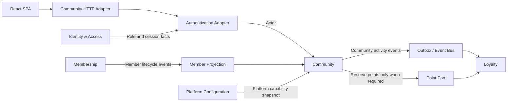
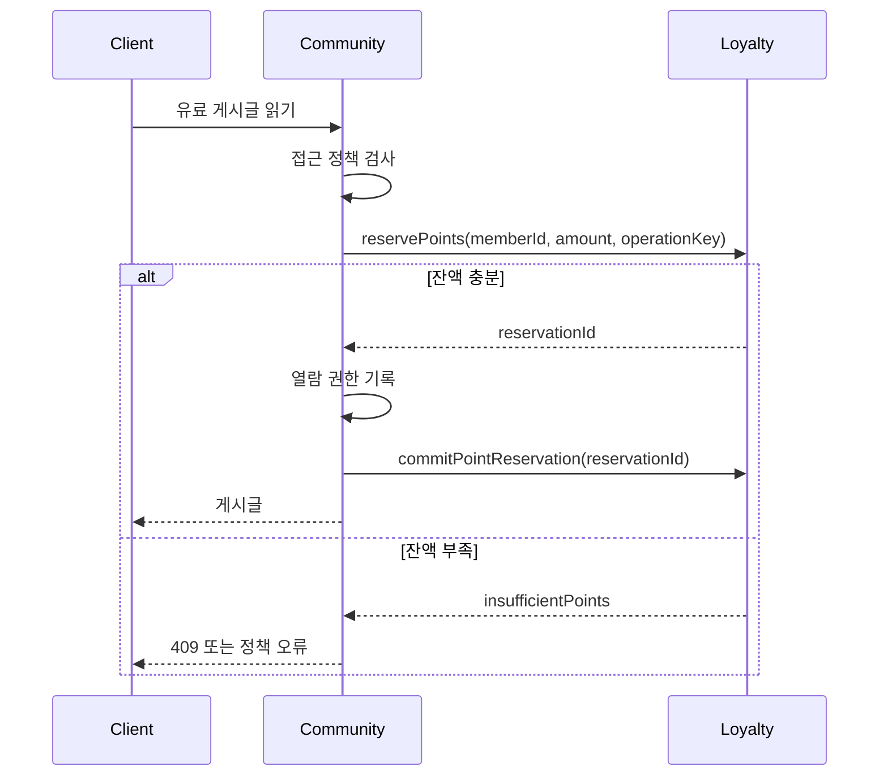
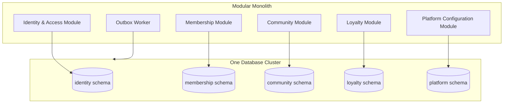

# 게시판과 공통 기능의 느슨한 연결 제안

## 결론

현재 그누보드5에서 회원, 권한, 설정과 포인트는 게시판 코드에 직접 연결되어 있다. 그러나 네 영역을 하나의 공통 모듈로 유지할 필요는 없다.

권장 방향은 다음과 같다.

- 인증 결과는 요청 시작 시 `Actor`로 변환하여 게시판에 전달한다.
- 회원 원본 대신 게시판에 필요한 최소 회원 projection만 사용한다.
- 게시판 접근 규칙과 게시판별 설정은 `Community`가 소유한다.
- 포인트 적립은 비동기 이벤트, 포인트 차감은 예약·확정 interface로 연동한다.
- 다른 bounded context의 테이블을 직접 조회하거나 수정하지 않는다.
- bounded context를 처음부터 별도 프로세스나 마이크로서비스로 배포하지 않는다.

HTTP 호출로 바꾸는 것만으로는 느슨한 연결이 되지 않는다. 호출자가 상대 context의 테이블 구조, 처리 순서와 실패 복구 방법을 계속 알아야 한다면 네트워크를 사이에 둔 강한 결합일 뿐이다.

## 현재 결합

| 영역 | 현재 게시판과의 결합 | 문제 |
|---|---|---|
| 회원 | 전역 `$member`와 `g5_member`를 직접 사용 | 게시판이 회원 스키마와 상태 표현을 알아야 함 |
| 권한 | `mb_level`, 최고·그룹·게시판 관리자 여부를 직접 조합 | 인증, 플랫폼 권한과 게시판 정책이 혼합됨 |
| 설정 | 전역 `$config`, `$board`, `$group`을 모든 실행 파일에서 사용 | 변경 영향 범위와 설정 소유자가 불명확함 |
| 포인트 | 게시글 작성·조회·댓글 처리에서 `insert_point()` 직접 호출 | 게시판 트랜잭션과 포인트 원장이 결합됨 |

## 목표 Context Map



## 1. 회원 연결 변경

### 현재 방식

게시판 요청은 공통 초기화 과정에서 전체 회원 레코드를 `$member`에 적재한다. 게시판 구현은 회원 ID, 레벨, 닉네임, 포인트, 본인인증, 차단·탈퇴 상태 등 여러 컬럼을 직접 참조한다.

### 목표 방식

`Community`는 회원 전체가 아니라 다음 두 값만 사용한다.

1. 요청을 수행하는 `Actor`
2. 표시와 게시판 정책 판정에 필요한 `CommunityMemberProjection`

예시 모델은 다음과 같다.

```text
Actor
  principalId
  memberId?
  platformRoles
  authenticated

CommunityMemberProjection
  memberId
  displayName
  status
  ageVerified
  identityVerified
```

`Actor`는 요청 시작 시 인증 adapter가 만든 불변값이다. Community 명령이 실행되는 동안 회원 테이블을 반복해서 조회하지 않는다.

`CommunityMemberProjection`은 Membership 이벤트를 받아 Community가 자신의 저장소에 유지하는 읽기 모델이다.

- `MemberActivated`
- `MemberProfileChanged`
- `MemberVerified`
- `MemberSuspended`
- `MemberWithdrawn`
- `MemberAnonymized`

게시글에는 `MemberId`와 작성 당시의 표시명 snapshot을 저장한다. 회원 닉네임 변경을 과거 게시글에 반영할지는 projection 정책으로 선택할 수 있다. 회원이 익명화되면 Community는 회원 개인정보를 조회하지 않고 `MemberAnonymized` 이벤트에 따라 표시명을 변경한다.

### 피해야 할 방식

- Community SQL에서 Membership 테이블 JOIN
- 게시글 응답마다 Membership REST endpoint 호출
- 회원 객체 전체를 Community interface의 인자로 전달
- 회원 레벨, 주소, 이메일과 포인트 잔액을 게시글에 복제

## 2. 권한 연결 변경

### 권한을 두 종류로 분리

권한은 인증 context가 모두 소유하는 하나의 중앙 기능으로 만들기보다 다음처럼 나눈다.

#### Identity & Access 소유

- 로그인 여부
- 플랫폼 운영자 역할
- 시스템 전체 권한
- 인증 세션과 Principal

#### Community 소유

- 게시판 공개 범위
- 게시판 읽기·쓰기·댓글 정책
- 게시판 관리자와 운영자 배정
- 비밀글 접근 규칙
- 작성자 수정·삭제 규칙
- 게시판별 본인·성인 인증 요구

게시판 규칙은 `CommunityAccessPolicy`라는 내부 정책으로 판정한다.

```text
canReadBoard(actor, boardPolicy)
canPublishPost(actor, boardPolicy)
canReadPost(actor, boardPolicy, post)
canRevisePost(actor, post)
canModerateBoard(actor, boardId)
```

숫자 `mb_level`을 새 외부 계약으로 유지하지 않는다. 마이그레이션 기간에는 anti-corruption adapter가 기존 레벨을 역할과 권한으로 변환한다.

### 호출 원칙

- 인증은 HTTP 요청 시작 시 한 번 수행한다.
- Community는 전달받은 `Actor`와 자신이 소유한 정책으로 접근을 판정한다.
- 매 게시글 조회마다 Identity & Access에 동기 호출하지 않는다.
- 플랫폼 역할 변경은 짧은 세션 수명 또는 세션 폐기로 반영한다.
- 게시판별 권한 변경은 Community 트랜잭션으로 즉시 반영한다.

이 구조는 Identity & Access 장애가 이미 인증된 모든 게시판 읽기 요청으로 전파되는 것을 줄인다.

## 3. 설정 연결 변경

`Settings`라는 거대한 공통 bounded context를 만들면 기존 `$config` 전역 객체의 문제가 반복된다. 설정은 의미를 소유하는 context로 나눠야 한다.

| 설정 종류 | 소유 context |
|---|---|
| 세션 수명, 비밀번호 정책 | `Identity & Access` |
| 가입 허용, 닉네임 변경, 본인인증 정책 | `Membership` |
| 읽기·쓰기 조건, 비밀글, 첨부 제한 | `Community` |
| 글쓰기·댓글·조회 포인트 규칙 | `Loyalty` 또는 Community와 합의된 reward policy |
| 사이트명, 공개 URL, 공통 기능 플래그 | `Platform Configuration` |
| 메일·SMS provider 자격증명 | 해당 adapter의 운영 설정 |

Community가 소유할 모델은 `BoardPolicy`와 `CommunityPolicy`다.

```text
BoardPolicy
  visibility
  postingRule
  commentingRule
  secretPostRule
  verificationRequirement
  attachmentPolicy
  moderationPolicy
```

설정은 문자열 key-value 묶음보다 타입이 있는 정책으로 모델링한다. 설정 변경은 일반 테이블 UPDATE가 아니라 의미가 분명한 명령을 사용한다.

```text
changeBoardVisibility()
changePostingRule()
requireIdentityVerification()
changeAttachmentPolicy()
```

클라이언트는 렌더링에 필요한 공개 capability만 받는다.

```text
BoardCapabilities
  readable
  postable
  commentable
  secretPostAllowed
  attachmentAllowed
  denialReason?
```

React SPA가 `mb_level >= bo_write_level` 같은 규칙을 다시 구현하지 않도록 서버가 최종 capability를 계산해야 한다.

## 4. 포인트 연결 변경

포인트는 획득과 사용의 성격이 다르므로 같은 방식으로 연결하면 안 된다.

### 적립: 비동기 이벤트

게시글·댓글 작성처럼 Community 작업의 성공 조건이 포인트 즉시 적립이 아닌 경우 domain event를 발행한다.

```text
PostPublished
  eventId
  memberId
  boardId
  postId
  occurredAt

CommentPublished
  eventId
  memberId
  boardId
  postId
  commentId
  occurredAt
```

Loyalty는 이벤트와 자신의 reward policy를 사용해 포인트를 적립한다. Community가 포인트 금액이나 포인트 테이블 구조를 알 필요가 없다.

Loyalty는 `eventId` 또는 `source + sourceId + action`을 idempotency key로 사용하여 같은 활동에 포인트를 한 번만 지급한다.

게시글 트랜잭션과 이벤트 저장은 transactional outbox로 함께 커밋한다. 이벤트 전달 실패 때문에 게시글을 롤백하지 않으며, worker가 재시도한다.

### 회수: 보상 이벤트

포인트가 지급된 게시글이나 댓글을 삭제했을 때 기존 원장 행을 삭제하지 않는다.

- `PostDeleted`
- `CommentDeleted`
- `ModerationRemovedContent`

Loyalty는 원 지급 건을 찾아 반대 방향의 보상 원장 행을 기록한다. 같은 삭제 이벤트가 반복되어도 한 번만 회수해야 한다.

### 차감: 동기 예약과 확정

기존 그누보드는 게시글 읽기나 파일 다운로드 전에 포인트가 부족하면 작업을 거부할 수 있다. 이 경우 비동기 이벤트만으로는 불충분하다.

Community는 작은 Point interface를 동기 호출한다.

```text
reservePoints(memberId, amount, operationKey)
commitPointReservation(reservationId)
releasePointReservation(reservationId)
```

권장 흐름은 다음과 같다.



`operationKey`는 같은 사용자의 새로고침이나 재시도로 포인트가 중복 차감되지 않도록 `memberId + action + resourceId + policyPeriod` 등으로 구성한다.

게시판 읽기·다운로드 포인트 기능을 새 제품에서 제거할 수 있다면 이 동기 seam 자체를 없애고 모든 활동 포인트를 비동기로 처리할 수 있다. 이는 결합도를 가장 크게 낮추는 제품 정책 결정이다.

## 데이터 소유권 규칙

느슨한 연결의 핵심은 코드 폴더보다 쓰기 데이터 소유권이다.

| 데이터 | 유일한 쓰기 소유자 |
|---|---|
| Principal, Credential, Session | `Identity & Access` |
| Member, Profile, Verification | `Membership` |
| Board, BoardPolicy, Post, Comment | `Community` |
| PointAccount, PointEntry, PointReservation | `Loyalty` |
| 플랫폼 공통 기능 플래그 | `Platform Configuration` |

다음 규칙을 적용한다.

- 다른 context의 테이블을 직접 UPDATE하지 않는다.
- 다른 context의 원본 테이블과 도메인 JOIN을 만들지 않는다.
- 참조는 UUID 같은 안정적인 식별자를 사용한다.
- 필요한 표시 정보는 이벤트로 관리하는 local projection 또는 발생 당시 snapshot으로 보존한다.
- 여러 context를 합친 목록 화면은 별도 query layer가 read model로 제공한다.
- query layer는 명령을 실행하거나 도메인 불변식을 결정하지 않는다.

## 통합 계약

### 동기 interface가 적합한 경우

- 요청 성공 여부를 즉시 결정해야 함
- 최신 상태가 반드시 필요함
- 실패하면 원 작업을 진행할 수 없음

예시는 포인트가 필요한 콘텐츠의 열람 전 포인트 예약이다.

### 이벤트가 적합한 경우

- 후속 처리가 원 작업의 성공 조건이 아님
- 잠시 지연되어도 됨
- producer가 consumer의 처리 규칙을 알 필요가 없음

예시는 게시글 작성에 따른 포인트 적립, 알림과 검색 인덱스 갱신이다.

### Projection이 적합한 경우

- 조회가 빈번함
- 일부 지연을 허용할 수 있음
- 원본 context 장애가 조회 전체로 전파되면 안 됨

예시는 작성자 표시명, 회원 상태와 인증 여부다.

## 실패 처리

느슨한 연결에서는 실패 의미를 계약에 포함해야 한다.

### Outbox와 Inbox

- Community 트랜잭션에서 Post와 outbox event를 함께 저장한다.
- publisher는 전송 성공까지 재시도한다.
- Loyalty inbox는 처리한 event ID를 기록한다.
- 동일 이벤트가 여러 번 도착해도 결과는 한 번만 반영한다.

### Projection 지연

Membership에서 회원을 차단했지만 Community projection 갱신이 지연될 수 있다. 보안에 민감한 쓰기 명령은 짧은 수명의 Actor claim이나 Membership의 최신 상태 확인을 사용하고, 공개 작성자 표시는 eventual consistency를 허용할 수 있다.

일관성 요구를 데이터별로 구분해야 한다.

| 데이터 | 요구 일관성 |
|---|---|
| 로그인 및 운영 권한 | 강한 일관성 또는 매우 짧은 캐시 |
| 게시판별 작성 권한 | Community 내부 강한 일관성 |
| 포인트 차감 | 강한 일관성 |
| 포인트 적립 표시 | 최종 일관성 허용 |
| 작성자 닉네임 표시 | 최종 일관성 허용 |
| 탈퇴 회원 표시명 익명화 | 짧은 지연 허용, 완료 추적 필요 |

## 초기 배포 구조

느슨한 연결을 위해 곧바로 네트워크를 추가할 필요는 없다.



초기에는 같은 프로세스 안의 interface로 호출하되 다음을 금지한다.

- 모듈 외부에서 repository import
- context 간 ORM entity 공유
- 다른 context schema에 대한 쓰기
- 공통 `Member` 또는 `Config` 객체 공유
- 다른 context의 내부 오류 형식 노출

향후 별도 배포가 필요해지면 같은 interface에 HTTP, gRPC 또는 message adapter를 붙인다. 호출자가 도메인 규칙을 다시 구현하지 않으면 배포 방식 변경이 interface에 영향을 주지 않는다.

## REST adapter 원칙

REST endpoint는 context를 느슨하게 만드는 핵심 수단이 아니라 외부 transport adapter다.

Community endpoint는 다음 역할만 담당한다.

1. HTTP 요청을 명령 또는 query로 변환
2. 인증 결과를 `Actor`로 변환
3. Community interface 호출
4. 결과를 HTTP 상태와 JSON으로 변환

React SPA가 회원 레벨, 포인트 정책과 게시판 설정을 조합해 권한을 판정하지 않도록 한다. 서버 응답에 현재 Actor 기준 capability를 포함한다.

```json
{
  "id": "board-123",
  "name": "notice",
  "capabilities": {
    "read": true,
    "publishPost": false,
    "publishComment": true,
    "uploadAttachment": false
  }
}
```

## 단계적 전환 방법

### 1단계: 동작 고정

- 회원 등급별 읽기·쓰기·댓글·다운로드 권한 테스트
- 차단·탈퇴·본인인증·성인인증 시나리오 테스트
- 글쓰기·댓글·읽기·다운로드 포인트 적립과 차감 테스트
- 삭제와 관리자 삭제에 따른 포인트 회수 테스트

### 2단계: 직접 호출 감싸기

기존 `get_member()`, `is_admin()`, `insert_point()` 호출을 작은 interface 뒤로 이동한다. 최초 adapter는 기존 PHP 함수와 테이블을 그대로 사용할 수 있다.

```text
CurrentMemberPort
CommunityAuthorizationPort
PointPort
```

이 단계에서는 동작을 변경하지 않고 호출 지점을 집중시킨다.

### 3단계: Community 정책 이동

- 게시판 접근 규칙을 `CommunityAccessPolicy`로 이동
- 게시판별 설정을 `BoardPolicy`로 변환
- HTML alert와 redirect를 명시적인 결과·오류로 변경
- REST adapter와 기존 PHP adapter가 같은 Community interface 사용

### 4단계: 이벤트 도입

- 게시글·댓글 활동을 outbox event로 발행
- Loyalty가 이벤트를 소비해 포인트 적립·회수
- Membership 이벤트로 Community 회원 projection 유지
- 소비자 멱등성과 실패 재처리 구현

### 5단계: 데이터 소유권 분리

- Community가 회원 및 포인트 테이블을 직접 조회하지 못하게 제한
- context별 repository와 schema 분리
- 통합 조회는 read model로 교체
- 정적 의존성 검사와 데이터베이스 권한으로 역참조 방지

### 6단계: 선택적 독립 배포

팀 소유권, 장애 격리, 확장성과 배포 주기가 실제로 달라질 때만 특정 context를 별도 프로세스로 분리한다.

## 반드시 결정할 제품 정책

다음 정책은 기술만으로 결정할 수 없으며 결합도에 직접 영향을 준다.

- 게시글 읽기와 파일 다운로드에 포인트를 계속 차감할지
- 포인트 지급 실패가 게시글 작성 실패를 의미해야 하는지
- 회원 닉네임 변경을 기존 게시글에 즉시 반영할지
- 차단된 회원의 기존 게시글을 계속 공개할지
- 탈퇴 회원의 작성자 표시를 익명화할지
- 게시판별 숫자 회원 등급을 계속 지원할지
- 본인·성인 인증 상태 변경을 기존 콘텐츠 접근에 언제 반영할지

가장 큰 단순화는 읽기·다운로드 포인트 차감을 제거하는 것이다. 이를 유지하면 Community와 Loyalty 사이에 강한 일관성이 필요한 동기 seam이 남는다. 적립만 유지하면 두 context를 대부분 비동기 이벤트로 연결할 수 있다.

## 최종 제안

다음 구조를 권장한다.

- `Identity & Access`는 Principal, 세션과 플랫폼 역할을 소유한다.
- `Membership`은 회원 프로필, 상태와 인증을 소유한다.
- `Community`는 게시판, 콘텐츠, 게시판 정책과 게시판별 권한을 소유한다.
- `Loyalty`는 포인트 규칙, 원장과 잔액을 소유한다.
- `Platform Configuration`은 사이트 전체 기능 플래그만 소유한다.

Community는 인증된 `Actor`, 최소 회원 projection과 명시적인 Point interface만 사용한다. 포인트 적립·회수는 이벤트로, 작업 전에 잔액이 필요한 포인트 차감만 예약·확정 방식의 동기 interface로 처리한다.

이렇게 하면 게시판은 회원 테이블, 전역 설정 객체와 포인트 원장의 구현을 알지 않으면서도 기존 접근 정책과 활동 보상 기능을 유지할 수 있다.

## 관련 문서

- [그누보드5 회원관리 및 영카트 분석](./gnuboard5-member-youngcart-analysis.md)
- [Bounded Context 분리 제안](./bounded-context-proposal.md)
- [그누보드5 플랫폼 성격](./gnuboard5-platform-characterization.md)
