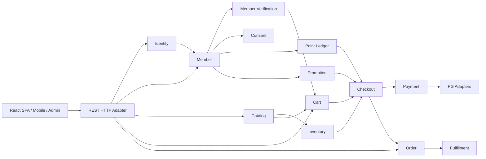
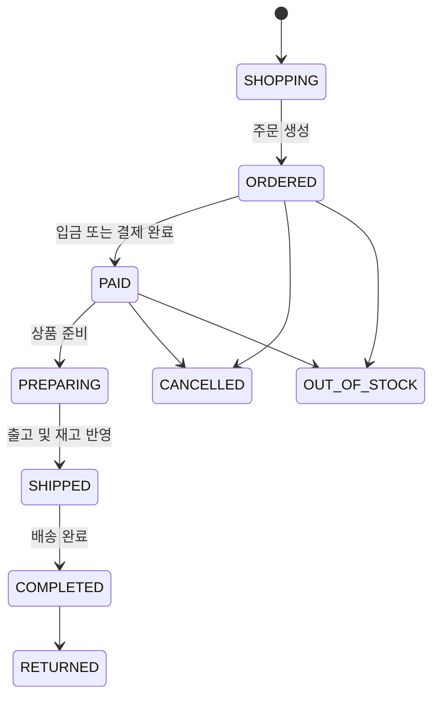

# 그누보드5 회원관리 및 영카트 분석

## 문서 목적

이 문서는 `/Users/yoophi/project/ext/gnuboard5`의 그누보드5 5.6.38 코드를 조사하여, React SPA 등의 클라이언트가 사용하는 REST API 플랫폼으로 재작성할 때 필요한 도메인 규칙과 구조적 위험을 정리한다.

조사 대상은 다음과 같다.

- 회원가입, 인증, 로그인, 자동 로그인, 회원 상태 및 관리자 권한
- 포인트, 동의 이력, 본인인증 및 소셜 로그인
- 영카트의 상품, 옵션, 장바구니, 주문, 쿠폰, 결제, 재고 및 배송
- 회원관리와 영카트 사이의 결합
- REST API 플랫폼으로 전환할 때 필요한 모듈과 마이그레이션 원칙

## 저장소 개요

그누보드5는 PHP와 MySQL 또는 MariaDB를 사용하는 전통적인 서버 렌더링 애플리케이션이다. 프레임워크의 중앙 라우터 대신 개별 PHP 파일이 HTTP 요청 진입점이며, 각 파일은 `common.php`를 통해 공통 실행 환경을 구성한다.

주요 특성은 다음과 같다.

- 그누보드 공통 설치 테이블 33개
- 영카트 설치 테이블 28개
- `shop`, `mobile/shop`, `adm/shop_admin`의 PHP 코드 약 61,000줄
- PC와 모바일 쇼핑몰에 같은 이름의 파일 40개 존재
- PC와 모바일 주문 처리 파일이 각각 약 1,100줄이며 상당한 로직 중복 존재
- 전역 변수 `$g5`, `$config`, `$default`, `$member`와 동적 `include`에 강하게 의존
- 설치 스키마는 대부분 MyISAM이며 외래키가 없음
- HTML 렌더링, 입력 검증, 권한 검사, SQL 및 외부 연동이 같은 실행 파일에 혼재

공통 초기화는 다음 순서로 동작한다.

1. 경로 및 설정 상수 정의
2. `data/dbconfig.php` 로드와 데이터베이스 연결
3. PHP 세션 시작
4. 사이트 설정과 회원 정보 조회
5. 자동 로그인 처리
6. 게시판, 테마, 모바일 및 영카트 설정 구성
7. `extend/*.php` 확장 파일 자동 로드
8. 요청별 PHP 실행 파일로 복귀

## 전체 도메인 관계

회원관리와 영카트는 포인트, 쿠폰, 본인인증, 장바구니 및 주문 소유권을 통해 직접 연결된다.



## 회원관리 분석

### 회원 데이터

`g5_member` 테이블 하나에 다음 정보가 집중되어 있다.

- 로그인 ID와 비밀번호 해시
- 이름, 닉네임, 이메일, 전화번호 및 주소
- 회원 레벨
- 본인인증 방식, 성인 여부 및 중복가입 확인값
- 포인트 잔액
- 최근 로그인 시각과 IP
- 가입, 탈퇴 및 접근 차단 상태
- 이메일, SMS, 마케팅 및 제3자 제공 동의
- 서명, 프로필과 관리자 메모
- 범용 확장 필드 `mb_1`부터 `mb_10`

주요 식별자는 자동 증가값인 `mb_no`와 문자열 로그인 ID인 `mb_id`다. 대부분의 관련 테이블은 데이터베이스 외래키 없이 `mb_id` 문자열을 저장한다.

REST 재작성에서는 다음 책임을 분리해야 한다.

- `Identity`: 자격증명, 로그인, 세션과 외부 계정 연결
- `Member`: 회원 상태와 기본 프로필
- `MemberVerification`: 이메일, 휴대전화, 실명 및 성인 인증
- `Consent`: 동의 종류별 현재 상태와 변경 이력
- `PointLedger`: 포인트 원장, 만료와 가용 잔액
- `Authorization`: 역할, 권한과 리소스 범위

### 로그인과 세션

기본 로그인 흐름은 다음과 같다.

1. ID와 비밀번호 입력 검사
2. 회원 조회와 비밀번호 해시 검증
3. 접근 차단, 탈퇴 및 이메일 미인증 여부 검사
4. 세션 ID 재생성
5. `ss_mb_id`와 회원 세션 검증키 저장
6. 일일 최초 로그인 포인트 지급
7. 선택적으로 자동 로그인 토큰 발급
8. 소셜 로그인 후처리
9. 영카트 장바구니 정리

자동 로그인은 기기별 토큰 방식이다. 원본 토큰은 쿠키에 저장하고 SHA-256 해시는 `g5_member_auto_login`에 저장한다. 토큰에는 만료시각, 최근 사용시각, IP와 User-Agent가 함께 기록된다. 로그아웃은 현재 기기의 자동 로그인 토큰만 삭제한다.

현재 인증은 PHP 세션과 같은 출처의 브라우저 요청을 전제로 한다. React SPA에서는 다음 정책을 명시해야 한다.

- 브라우저 세션은 HttpOnly, Secure 쿠키 사용
- 장기 토큰은 회전식 refresh session으로 관리
- SPA와 API의 출처가 다르면 명시적 CORS와 credential 정책 적용
- 쿠키 인증 변경 요청에는 CSRF 방어 적용
- 세션 목록 조회, 현재 기기 로그아웃 및 전체 기기 로그아웃 제공
- 외부 클라이언트 공개가 필요하면 OAuth 2.1 또는 OIDC로 확장 가능한 구조 사용
- 브라우저 `localStorage`에 장기 JWT를 보관하지 않음

### 회원가입

회원가입은 단순한 회원 레코드 생성이 아니라 다음 작업을 함께 수행한다.

1. CAPTCHA 검사
2. ID, 닉네임과 이메일 유효성 및 중복 검사
3. 예약 ID, 예약 닉네임과 금지 이메일 검사
4. 서버 세션에 저장된 중복검사 결과 확인
5. 본인인증 결과와 입력값 일치 확인
6. 추천인 검사
7. 비밀번호 해싱과 회원 생성
8. 선택 동의 상태와 동의 로그 저장
9. 가입 포인트와 추천인 포인트 지급
10. 이메일 인증 토큰 생성과 메일 발송
11. 설정에 따라 영카트 가입 쿠폰 발급
12. 이메일 인증을 사용하지 않으면 로그인 세션 생성

새 시스템에서는 `registerMember(command)`라는 작은 인터페이스 뒤에 이 규칙을 집중시키는 것이 적합하다. 메일, 본인인증, CAPTCHA와 파일 저장은 주 구현에서 주입받는 adapter로 분리한다.

회원 생성과 포인트·쿠폰 지급은 가능한 한 같은 데이터베이스 트랜잭션에서 처리하고, 이메일 발송은 outbox를 사용하는 것이 안전하다.

### 회원정보와 동의

회원은 닉네임, 연락처, 주소, 프로필, 마케팅 수신 여부 등을 수정할 수 있다. 닉네임 변경에는 설정된 변경 제한 기간이 적용되고, 이메일 변경 시 이메일 인증을 다시 요구할 수 있다.

현재 동의 변경 내역은 `mb_agree_log` 텍스트 필드 앞부분에 계속 추가된다. REST 재작성에서는 다음과 같이 정규화하는 편이 적합하다.

- `member_consents`: 회원별 동의 종류와 현재 상태
- `member_consent_events`: 동의, 철회, 시각, 출처, 정책 버전과 IP 이력

동의 종류는 적어도 마케팅 목적 개인정보 이용, 광고성 이메일, 광고성 SMS·카카오톡, 개인정보 제3자 제공을 구분해야 한다.

### 본인인증과 이메일 인증

회원가입과 회원정보 수정은 다음 인증 상태를 취급한다.

- 이메일 인증
- 휴대전화 인증
- 간편인증
- 아이핀
- 성인 인증
- 중복가입 확인값

인증 결과는 현재 PHP 세션의 여러 키에 임시 저장된다. 새 시스템에서는 일회용 `verification_transaction`을 발급하고, 콜백 결과와 회원가입 요청이 같은 거래를 참조하도록 만드는 것이 적합하다.

이메일 인증 토큰은 일회용이며 유효시간이 있고, 성공 또는 만료 시 폐기된다. 이 의미를 새 시스템에서도 유지해야 한다.

### 회원 상태와 삭제

현재 탈퇴와 관리자 삭제는 의미가 다르다.

- 탈퇴: `mb_leave_date`를 설정하고 본인인증 및 복구 토큰을 제거하는 soft delete
- 접근 차단: `mb_intercept_date` 이후 로그인을 거부
- 관리자 삭제: ID 재사용을 막기 위해 회원 행을 남긴 채 개인정보, 포인트, 권한, 쪽지와 프로필 파일을 제거

새 시스템에서는 다음 상태를 명시적으로 모델링하는 것이 좋다.

- `ACTIVE`
- `SUSPENDED`
- `WITHDRAWN`
- `ANONYMIZED`

회원 탈퇴와 개인정보 익명화는 별도 명령으로 취급하고, 게시물·주문처럼 법적 또는 운영상 보존해야 하는 데이터와의 관계를 정책으로 정의해야 한다.

### 권한

현재 권한 모델은 세 가지 방식이 혼합돼 있다.

- 숫자 회원 레벨 `mb_level`
- 최고관리자, 그룹관리자, 게시판관리자 구분
- 관리자 메뉴별 `r`, `w`, `d` 권한

REST 플랫폼에서는 숫자 레벨 자체를 클라이언트 계약으로 노출하지 않는 편이 좋다. 다음 형태가 적합하다.

- 역할: `member`, `operator`, `administrator`
- 권한: `members.read`, `members.manage`, `orders.read`, `orders.manage`
- 리소스 범위: 특정 게시판, 상품 카테고리 또는 전체

기존 `mb_level` 기반 게시판·상품 접근 규칙을 이전해야 한다면 내부 정책 adapter에서 새 역할·권한으로 변환한다.

### 포인트

포인트는 다음 두 곳에 저장된다.

- `g5_point`: 발생, 사용, 만료와 관련 작업을 기록하는 원장
- `g5_member.mb_point`: 현재 잔액 캐시

포인트에는 만료일이 있으며 오래된 포인트부터 사용한다. 주문 결제, 가입, 추천, 로그인, 게시글 활동 및 주문 완료 등 여러 기능이 원장에 기록한다.

MyISAM에서 동시성을 다루기 위해 named lock과 조건부 UPDATE를 사용한다. 새 시스템에서는 원장을 진실의 원천으로 삼고, 다음 불변식을 데이터베이스 트랜잭션으로 보장해야 한다.

- 사용 가능한 잔액은 음수가 될 수 없음
- 같은 관련 작업은 한 번만 적립 또는 차감
- 주문 취소 보상도 멱등 처리
- 잔액 캐시는 원장에서 재계산 가능

## 영카트 분석

### 주요 데이터 영역

영카트의 28개 테이블은 다음 영역을 다룬다.

- 상품 배너와 이벤트
- 카테고리
- 상품과 선택·추가 옵션
- 장바구니와 주문 항목
- 주문 헤더와 배송지
- 쿠폰, 쿠폰존과 사용 로그
- 상품평과 상품문의
- 관련 상품과 찜
- 개인결제
- 재고 알림
- 주문 POST 로그와 취소 로그
- 이니시스와 KCP 결제·통보 로그
- 쇼핑몰 전역 설정

### 상품과 옵션

상품은 다음 정보를 한 행에 보관한다.

- 기본 카테고리와 추가 카테고리
- 상품명, 브랜드, 제조사, 원산지와 모델
- 정상가, 판매가, 포인트와 과세 여부
- 판매 여부와 품절 여부
- 기본 재고와 알림 기준
- 배송비 방식과 금액
- 구매 최소·최대 수량
- PC·모바일 설명과 스킨 설정
- 상품 이미지 최대 10개
- 범용 확장 필드 `it_1`부터 `it_10`

옵션은 `io_type`으로 선택옵션과 추가옵션을 구분하고, 옵션별 가격·재고·사용 여부를 저장한다.

새 스키마에서는 다음처럼 분리하는 것이 적합하다.

- `products`
- `product_variants`
- `product_options`
- `inventory_items`
- `product_media`
- `product_categories`

상품의 표시용 HTML과 모바일 전용 설명은 도메인 데이터와 분리하고, 클라이언트별 표현은 React SPA에서 처리해야 한다.

### 장바구니

현재 `g5_shop_cart`는 장바구니 항목과 주문 항목을 동시에 표현한다.

- 주문 전에는 임시 `od_id`와 `ct_status='쇼핑'`을 사용
- 바로구매와 일반 장바구니에 별도 세션 ID 사용
- 주문 시 선택된 행의 `od_id`를 실제 주문번호로 변경
- 이후 같은 행의 `ct_status`가 주문 상태를 따라감

새 시스템에서는 다음 테이블을 분리해야 한다.

- `carts`
- `cart_items`
- `orders`
- `order_items`

주문 항목에는 주문 당시의 상품명, 옵션명, 가격, 포인트, 과세 여부와 배송비를 스냅샷으로 저장해야 한다. 주문 이후 상품 정보 변경이 과거 주문에 영향을 주면 안 된다.

장바구니 입력에서 보존해야 할 핵심 규칙은 다음과 같다.

- 클라이언트가 전송한 상품 가격과 옵션 가격을 신뢰하지 않음
- 현재 서버 상품과 옵션을 조회하여 가격과 옵션 종류를 재구성
- 선택옵션 없는 상품과 필수 선택옵션 상품 구분
- 최소·최대 구매 수량 검사
- 현재 장바구니 수량을 포함한 누적 수량 검사
- 옵션별 재고 검사
- 기존 장바구니와 현재 가격이 다르면 병합 거부
- 정상적인 0원 상품은 허용하지만 조작된 0원 옵션은 거부
- 상품·카테고리별 본인인증과 성인인증 검사

### 가격과 쿠폰

주문 가격은 상품 가격 외에도 다음 요소로 구성된다.

- 선택옵션 및 추가옵션 가격
- 상품별 배송비와 추가 배송비
- 상품 쿠폰
- 주문 쿠폰
- 배송비 쿠폰
- 회원 포인트 사용
- 과세, 부가세 및 면세 금액

쿠폰은 정액 또는 비율 할인, 절사 단위, 최소 주문액과 최대 할인액을 지원한다. 쿠폰 사용 로그에는 `(cp_id, mb_id)` 유일 제약이 있어 같은 회원의 중복 사용을 차단한다.

REST 클라이언트가 보내야 하는 값은 선택한 상품·옵션·쿠폰 식별자와 수량뿐이어야 한다. 모든 금액은 서버의 `Pricing` 모듈이 다시 계산하고, 결과에는 계산 근거를 포함해야 한다.

### 주문 처리

현재 주문 처리 파일은 다음 workflow를 한 요청에서 수행한다.

1. 장바구니 존재 여부 확인
2. 과거 장바구니 데이터의 옵션 종류와 가격 재검증
3. 선택 항목별 재고 검사
4. 상품, 배송 및 쿠폰 금액 재계산
5. 포인트 사용 한도와 현재 잔액 검사
6. 결제수단 및 PG별 승인 결과 처리
7. PG 승인 금액과 서버 주문 금액 비교
8. 주문 헤더 저장
9. 장바구니 행을 주문 항목으로 전환
10. 회원 포인트 차감
11. 쿠폰 사용 로그 저장
12. 중복 쿠폰 발견 시 PG 취소와 로컬 데이터 복구
13. 주문 메일과 SMS 발송
14. 주문조회 세션과 배송지 저장

PG 승인 이후 주문 저장, 장바구니 변경, 포인트 차감 또는 쿠폰 저장이 실패하면 외부 결제를 취소하고 로컬 데이터를 복구하는 보상 로직이 실행된다.

새 시스템에서 `Checkout`은 다음 책임을 숨기는 깊은 모듈이어야 한다.

- 가격 스냅샷 생성
- 재고 선점
- 쿠폰 선점
- 포인트 선점
- 결제 승인
- 주문과 주문 항목 생성
- 실패 보상
- 후속 이벤트 기록

외부 인터페이스는 `placeOrder(command)`처럼 작게 유지하고, 클라이언트가 처리 순서나 내부 보상 규칙을 알 필요가 없어야 한다.

### 주문 상태

실제 코드가 사용하는 주요 상태는 다음과 같다.



기존 DB에는 `쇼핑`, `주문`, `입금`, `준비`, `배송`, `완료`, `취소`, `반품`, `품절` 한글 문자열을 직접 저장한다.

새 시스템에서는 코드와 표시명을 분리한다.

- `SHOPPING`
- `PENDING_PAYMENT`
- `PAID`
- `PREPARING`
- `SHIPPED`
- `COMPLETED`
- `CANCELLED`
- `RETURNED`
- `OUT_OF_STOCK`

주문 전체 상태와 주문 항목 상태를 분리해야 부분 취소, 부분 품절, 부분 배송과 부분 반품을 안전하게 표현할 수 있다. 상태 변경은 임의 필드 수정이 아니라 허용된 전이만 수행하는 명령이어야 한다.

### 재고

상품 또는 옵션별 재고를 관리한다. 현재 주요 규칙은 다음과 같다.

- 장바구니 담기와 주문 직전에 재고 확인
- 다른 선택 장바구니의 수량을 고려한 가용 재고 계산
- 관리자가 주문을 배송 상태로 변경할 때 실제 재고 차감
- 취소·반품·품절 등 상태에 따라 재고 복원 여부 결정
- `ct_stock_use`로 해당 주문 항목의 재고 반영 여부 표시

새 시스템에서는 `inventory_reservations`를 도입하여 checkout 시점에 재고를 선점하고, 결제 실패나 만료 시 해제하는 방식이 더 명확하다. 재고 증감에는 주문 항목과 연결된 멱등 키가 필요하다.

### 결제

저장소에는 다음 PG 연동 코드가 존재한다.

- NHN KCP
- KG이니시스 및 이니시스 PRO
- 토스페이먼츠
- NICEPAY
- LG U+
- 네이버페이
- 일부 레거시 카카오페이

결제수단은 무통장, 계좌이체, 가상계좌, 휴대전화, 신용카드와 간편결제를 지원한다.

PG 연동은 브라우저 redirect, form POST, webhook 또는 callback을 사용하므로 모든 흐름을 JSON REST 요청 하나로 대체할 수는 없다. 다음 seam을 정의하는 것이 적합하다.

```text
PaymentPort
  authorize()
  capture()
  cancel()
  handleCallback()
  reconcile()
```

각 PG는 production adapter를 제공하고 테스트에서는 in-memory adapter를 사용한다. callback 처리에는 다음 규칙이 필요하다.

- PG별 서명과 발신 정보 검증
- 원문 payload 보존
- callback 이벤트 식별자와 idempotency key 저장
- 같은 통보의 중복 처리 방지
- 주문 잠금 또는 원자적 상태 전이
- 로컬 주문과 PG 거래의 주기적 대사

### 주문 취소와 환불

주문자 직접 취소는 주문 소유권, 주문 및 주문 항목 상태, 기존 취소금액을 확인한 뒤 PG별 취소 처리를 수행한다. PG 취소가 성공하면 주문 항목과 주문 헤더를 취소 상태로 변경하고 사용 포인트를 복원한다.

이니시스 PRO는 입금 통보와 주문자 취소의 동시 처리를 막기 위해 주문 잠금을 사용한다.

새 시스템에서는 다음 명령을 구분해야 한다.

- `cancelOrder`
- `cancelOrderItems`
- `requestReturn`
- `approveReturn`
- `refundPayment`

환불 레코드는 주문 상태 변경과 별도로 보존하고 PG 요청·응답, 환불 금액과 처리 상태를 기록해야 한다.

### 배송과 완료

관리자가 주문을 `준비`에서 `배송`으로 변경할 때 택배사, 송장번호와 발송시각을 기록하고 재고를 차감한다. `완료` 시점 이후 상품별 적립 포인트가 지급된다.

새 시스템에서는 다음을 분리해야 한다.

- `shipments`: 배송 묶음, 택배사, 송장과 시각
- `fulfillment_events`: 준비, 출고, 배송 및 완료 이력
- `point_events`: 구매확정 또는 완료에 따른 적립

### 부가 기능

영카트에는 다음 기능도 포함된다.

- 상품평과 평점 집계
- 상품문의와 비밀문의
- 찜 목록
- 최근 본 상품
- 재입고 SMS 신청
- 이벤트와 배너
- 개인결제
- 주문 배송지 목록
- 매출, 상품 판매순위와 운영 보고서
- 주문 메일과 SMS

최근 본 상품처럼 클라이언트 로컬 상태로 충분한 기능과, 찜·문의처럼 서버 영속성이 필요한 기능을 구분해야 한다.

## 회원관리와 영카트의 결합 지점

REST 전환 전에 다음 동작을 characterization test로 고정해야 한다.

| 결합 지점 | 현재 동작 | 새 모듈 책임 |
|---|---|---|
| 로그인과 장바구니 | 로그인 성공 후 장바구니 정리 및 회원 컨텍스트 연결 | `Cart.claimGuestCart()` |
| 회원가입과 포인트 | 가입자와 추천인에게 포인트 지급 | `MemberRegistration`과 `PointLedger` |
| 회원가입과 쿠폰 | 쇼핑몰 설정에 따라 가입 쿠폰 발급 | `MemberRegistration`과 `Promotion` |
| 회원 등급과 구매 | 상품 구매 가능 레벨 검사 | `Authorization` 또는 `PurchaseEligibility` |
| 본인·성인 인증과 상품 | 상품·카테고리별 인증 조건 검사 | `PurchaseEligibility` |
| 포인트 결제 | 주문 생성 중 잔액 재검증 및 차감 | `Checkout`과 `PointLedger` |
| 쿠폰 사용 | 회원별 발급, 사용과 중복 방지 | `Promotion` |
| 주문 소유권 | 회원 ID 또는 비회원 주문 인증으로 조회 | `OrderAccessPolicy` |
| 배송지 | 회원별 주소 목록 저장 | `MemberAddress` |
| 상품평 | 구매 여부와 설정에 따라 작성 허용 | `ReviewPolicy` |
| 탈퇴·차단 | 로그인과 구매 제한 | `MemberStatusPolicy` |

## 권장 모듈 구조

초기에는 마이크로서비스보다 하나의 배포 단위를 가진 모듈러 모놀리스가 적합하다. 주문, 포인트, 쿠폰과 재고가 같은 데이터베이스 트랜잭션을 활용할 수 있어야 하기 때문이다.

```text
identity
members
member-verification
authorization
consents
points

catalog
inventory
carts
pricing-promotions
checkout
payments
orders
fulfillment
reviews
wishlists

administration
notifications
media
```

모듈의 외부 인터페이스는 작게 유지하고, HTTP 핸들러가 SQL이나 도메인 규칙을 직접 구현하지 않도록 한다. 예를 들어 `Checkout`을 삭제했을 때 가격 검증, 쿠폰, 포인트, 재고와 결제 보상 규칙이 여러 HTTP 핸들러에 다시 나타난다면 해당 모듈은 충분한 깊이와 locality를 제공하고 있는 것이다.

## REST 리소스 초안

다음은 기능 범위를 보여주는 초기 형태이며 최종 OpenAPI 계약은 아니다.

```text
POST   /v1/sessions
GET    /v1/sessions
DELETE /v1/sessions/{sessionId}
DELETE /v1/sessions

POST   /v1/members
GET    /v1/members/me
PATCH  /v1/members/me
POST   /v1/members/me/withdrawal
GET    /v1/members/me/points
GET    /v1/members/me/consents
PUT    /v1/members/me/consents/{consentType}

GET    /v1/categories
GET    /v1/products
GET    /v1/products/{productId}
GET    /v1/products/{productId}/reviews
POST   /v1/products/{productId}/reviews

GET    /v1/cart
POST   /v1/cart/items
PATCH  /v1/cart/items/{cartItemId}
DELETE /v1/cart/items/{cartItemId}
POST   /v1/cart/quote

POST   /v1/orders
GET    /v1/orders
GET    /v1/orders/{orderId}
POST   /v1/orders/{orderId}/cancellations
POST   /v1/orders/{orderId}/returns

POST   /v1/payments/{provider}/callbacks
POST   /v1/payments/{paymentId}/cancellations
```

결제 provider callback과 OAuth callback은 외부 시스템의 요구에 맞춘 전용 HTTP adapter이며, 일반적인 클라이언트 REST 리소스와 분리해야 한다.

## 주요 재작성 위험

### 데이터 무결성

- MyISAM과 외래키 부재로 기존 데이터에 고아 레코드가 존재할 수 있음
- 회원, 상품과 주문 식별자 길이 및 형식이 일관되지 않음
- `0000-00-00` 날짜와 빈 문자열을 상태 표현에 사용
- 주문 항목이 독립 테이블이 아니라 장바구니 행의 상태 변경으로 표현됨
- 포인트 잔액이 원장과 회원 테이블에 중복 저장됨

마이그레이션 전에 데이터 품질 검사를 수행하고, 불일치 유형별 보정 정책을 정해야 한다.

### 트랜잭션과 동시성

- MyISAM은 트랜잭션을 지원하지 않아 named lock과 보상 로직에 의존
- PG 승인 후 로컬 저장 실패 가능
- 포인트, 쿠폰 및 재고에 경쟁 조건 존재
- callback과 사용자 취소가 동시에 처리될 수 있음

새 시스템은 InnoDB 또는 트랜잭션을 지원하는 데이터베이스를 사용하고, 외부 결제에는 idempotency와 보상 workflow를 적용해야 한다.

### 표현과 규칙의 혼합

- HTML alert와 redirect가 오류 처리 방식으로 사용됨
- PC와 모바일 주문 처리 코드가 중복됨
- SQL, 권한, 검증, 메일과 화면 렌더링이 한 파일에 혼재
- 스킨 및 훅이 실행 중 전역 상태를 변경할 수 있음

새 HTTP adapter는 JSON 응답과 상태코드만 담당하고, 도메인 규칙은 모듈 인터페이스 뒤에 위치시켜야 한다.

### 개인정보와 보안

- 이름, 주소, 전화번호, 인증값과 IP 등 민감정보가 여러 테이블과 로그에 저장됨
- 비회원 주문 비밀번호와 주문조회 세션 방식이 존재
- 기존 소셜 로그인 라이브러리와 PG SDK의 최신성 검토 필요
- 쿠키 세션, CSRF, CORS와 외부 callback 보안 정책을 새로 정의해야 함

민감정보 분류, 암호화, 마스킹, 보존기간, 감사로그와 관리자 접근통제를 설계 초기에 포함해야 한다.

### 테스트

현재 저장소의 명시적 테스트는 최근의 장바구니 가격 검증, KCP 통보, 결제수단 표시, 포인트 지급, 마이그레이션 및 관리자 날짜 필터 보안 수정에 집중돼 있다. 전체 회원 생명주기와 주문 상태 전이를 포괄하는 회귀 테스트는 부족하다.

조사 환경에는 PHP 실행 파일이 없고 Playwright 의존성이 설치되지 않아 전체 테스트를 실행하지 못했다. JavaScript 기반 `pg_easypay.js` 테스트는 통과했다.

## 권장 재작성 순서

### 1단계: 기존 동작 고정

- 회원가입, 로그인, 자동 로그인, 탈퇴와 차단 테스트
- 가입 포인트 및 가입 쿠폰 테스트
- 상품·옵션 가격과 재고 계산 테스트
- 주문 상태 전이와 부분 취소 테스트
- PG callback 중복 처리와 보상 취소 테스트
- 운영 DB 데이터 품질 보고서 작성

### 2단계: 회원 기반 구축

- `Identity`, `Member`, `Consent`, `Authorization` 구현
- 세션과 이메일 인증 구현
- 기존 비밀번호 해시 호환 adapter 구현
- 회원 데이터 마이그레이션 도구 작성

### 3단계: 포인트와 카탈로그

- 포인트 원장과 멱등 처리 구현
- 상품, 옵션, 이미지 및 카테고리 구현
- 기존 영카트 상품 데이터 변환

### 4단계: 장바구니와 가격 계산

- 회원 및 비회원 장바구니 구현
- 로그인 시 guest cart claim 구현
- 서버 기준 가격 계산과 쿠폰 검증 구현
- 재고 선점 모델 도입

### 5단계: 주문과 결제

- 주문 및 주문 항목 스냅샷 구현
- 상태 전이 구현
- PG별 adapter와 callback 구현
- idempotency, outbox 및 결제 대사 구현

### 6단계: 운영 기능

- 관리자 회원·상품·주문 관리
- 배송과 환불
- 상품평, 문의와 찜
- 운영 보고서와 감사로그

## 조사 근거 파일

- 공통 초기화: `/Users/yoophi/project/ext/gnuboard5/common.php`
- 회원 스키마: `/Users/yoophi/project/ext/gnuboard5/install/gnuboard5.sql`
- 영카트 스키마: `/Users/yoophi/project/ext/gnuboard5/install/gnuboard5shop.sql`
- 로그인: `/Users/yoophi/project/ext/gnuboard5/bbs/login_check.php`
- 로그아웃: `/Users/yoophi/project/ext/gnuboard5/bbs/logout.php`
- 회원가입 및 수정: `/Users/yoophi/project/ext/gnuboard5/bbs/register_form_update.php`
- 회원 탈퇴와 삭제: `/Users/yoophi/project/ext/gnuboard5/lib/common.lib.php`
- 관리자 회원관리: `/Users/yoophi/project/ext/gnuboard5/adm/member_form_update.php`
- 관리자 권한: `/Users/yoophi/project/ext/gnuboard5/adm/admin.lib.php`
- 영카트 설정: `/Users/yoophi/project/ext/gnuboard5/shop.config.php`
- 영카트 공통 라이브러리: `/Users/yoophi/project/ext/gnuboard5/lib/shop.lib.php`
- 장바구니 검증: `/Users/yoophi/project/ext/gnuboard5/lib/shop.cartvalidate.lib.php`
- 장바구니 변경: `/Users/yoophi/project/ext/gnuboard5/shop/cartupdate.php`
- PC 주문 처리: `/Users/yoophi/project/ext/gnuboard5/shop/orderformupdate.php`
- 모바일 주문 처리: `/Users/yoophi/project/ext/gnuboard5/mobile/shop/orderformupdate.php`
- 관리자 주문 상태 변경: `/Users/yoophi/project/ext/gnuboard5/adm/shop_admin/admin.shop.lib.php`
- 주문자 취소: `/Users/yoophi/project/ext/gnuboard5/shop/orderinquirycancel.php`

## 최종 판단

그누보드5의 회원관리와 영카트를 REST API로 바꾸는 작업은 기존 PHP 실행 파일을 JSON 엔드포인트로 변환하는 수준이 아니다. 기존 구현에 분산된 회원 생명주기, 포인트, 쿠폰, 재고, 주문 상태와 결제 보상 규칙을 식별하고 깊은 모듈의 인터페이스 뒤로 재구성하는 재작성 프로젝트다.

초기 배포 형태는 모듈러 모놀리스가 적합하다. 회원·주문·포인트·쿠폰·재고를 일관된 트랜잭션 안에서 처리하면서도, PG·메일·SMS·본인인증·파일 저장은 adapter seam으로 분리해야 이후 독립 배포나 외부 플랫폼 확장이 가능하다.
