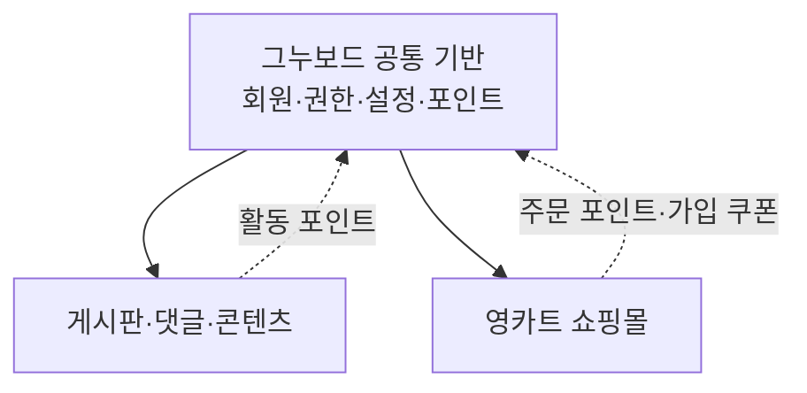

# 그누보드5 플랫폼 성격

## 요약

그누보드5는 제품 관점에서 **게시판이 포함된 회원 기반 쇼핑몰**이라고 설명할 수 있다. 그러나 코드와 도메인 구조를 기준으로는 **회원 기반 CMS에 커뮤니티와 영카트 쇼핑몰이 병렬로 결합된 통합 웹 플랫폼**이라고 표현하는 것이 더 정확하다.

## 구성 관계

### 그누보드 공통 기반

- 회원가입, 로그인과 자동 로그인
- 회원 상태, 본인인증과 성인인증
- 역할과 관리자 권한
- 포인트 원장과 회원 잔액
- 사이트 공통 설정
- 메일, SMS, 파일 및 확장 훅

### 커뮤니티 영역

- 게시판과 게시판 그룹
- 게시글, 답글과 댓글
- 공지와 비밀글
- 추천·비추천과 스크랩
- FAQ와 일반 콘텐츠
- 게시판 활동에 따른 포인트

### 영카트 영역

- 상품, 카테고리와 옵션
- 장바구니와 찜
- 가격, 쿠폰과 배송비
- 주문, 결제와 환불
- 재고, 출고와 배송
- 상품평과 상품문의

## 회원 기반이라고 판단하는 이유

게시판과 영카트는 모두 그누보드의 동일한 회원 모델을 사용한다. 영카트는 독립된 사용자 체계를 갖지 않고 다음 기능을 그누보드 회원관리와 공유한다.

- 회원 ID와 로그인 세션
- 회원 레벨에 따른 접근·구매 제한
- 본인인증과 성인인증 상태
- 포인트 적립과 사용
- 회원가입 쿠폰
- 주문 소유권과 배송지
- 탈퇴·차단 상태

로그인 성공 시 영카트 장바구니를 회원 컨텍스트에 연결하고, 회원가입 시 설정에 따라 포인트와 쇼핑몰 쿠폰을 발급한다. 주문 과정에서는 회원 포인트, 쿠폰, 인증 상태와 배송지를 함께 사용한다.

## 게시판이 쇼핑몰에 포함된 것은 아님

게시판은 쇼핑몰의 하위 기능이라기보다 그누보드 공통 기반을 공유하는 별도 도메인이다. 따라서 다음 표현을 구분하는 것이 좋다.

- 제품 소개: 게시판이 포함된 회원 기반 쇼핑몰
- 현재 코드 구조: 회원 기반 CMS에 게시판과 영카트가 결합된 구조
- 재작성 아키텍처: Membership을 공유하고 Community와 Commerce가 병렬로 존재하는 플랫폼

REST API 재작성에서는 게시판을 영카트 내부 모듈로 두지 않는다. `Identity & Access`와 `Membership`을 공통 기반으로 두고, `Community`와 Commerce 관련 bounded context가 회원 식별자와 필요한 회원 상태만 참조하도록 분리한다.

## 관련 문서

- [그누보드5 회원관리 및 영카트 분석](./gnuboard5-member-youngcart-analysis.md)
- [Bounded Context 분리 제안](./bounded-context-proposal.md)
