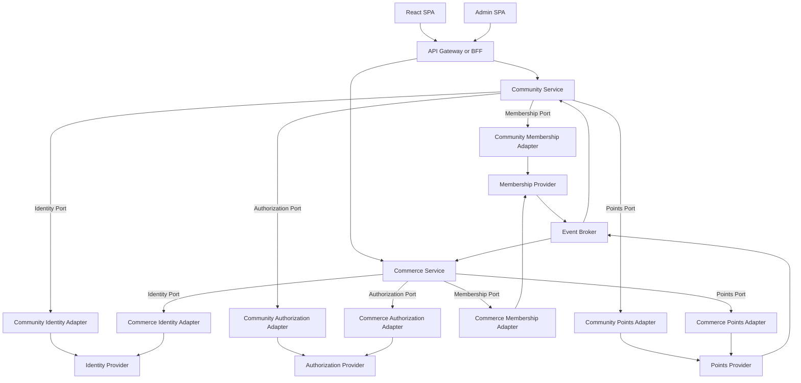
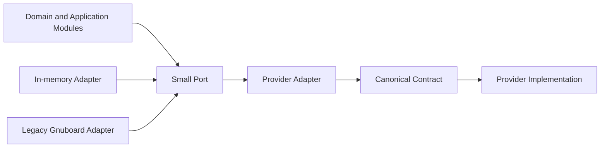
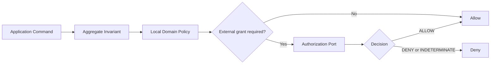
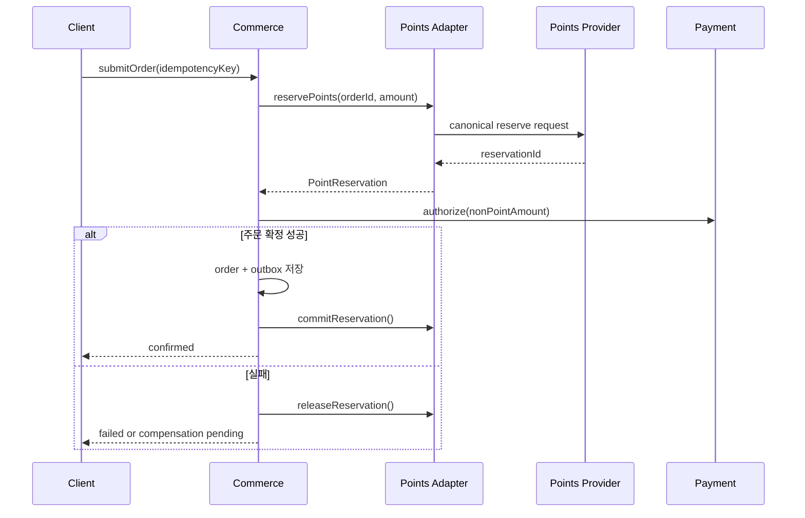
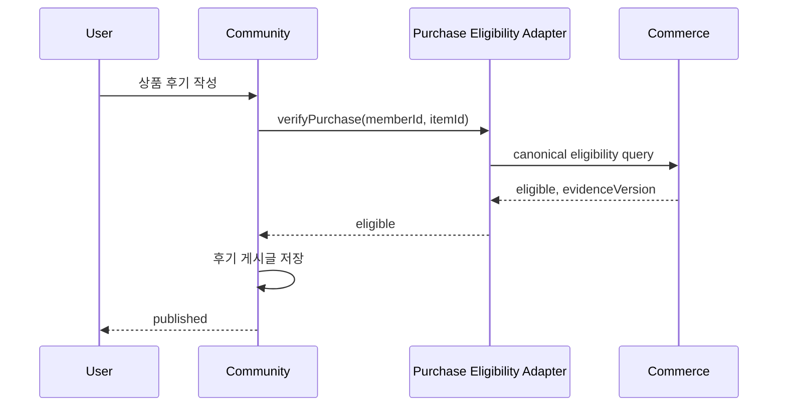
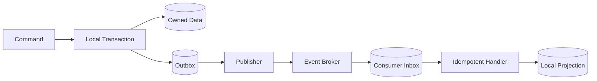
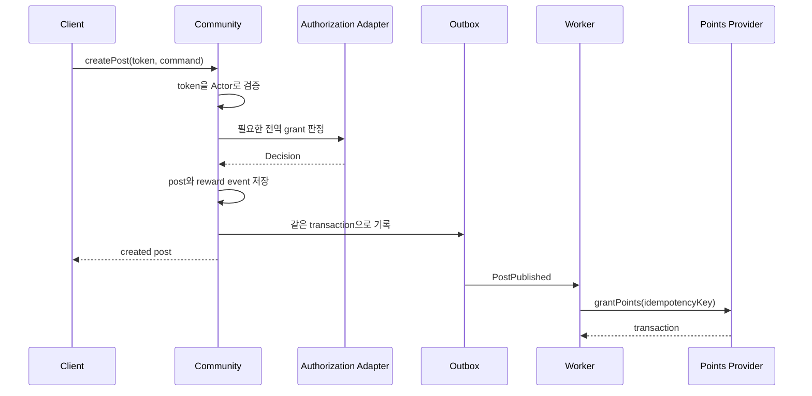
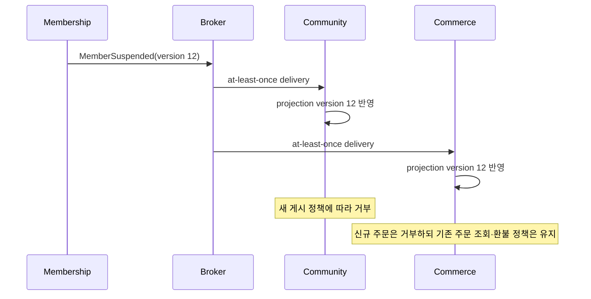
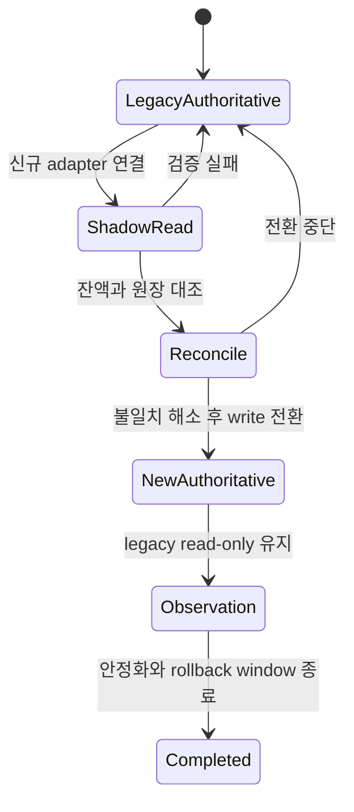

# 독립 게시판·쇼핑몰과 교체 가능한 공통 서비스 설계

## 1. 설계 목표

게시판과 쇼핑몰을 각각 독립적으로 배포·운영 가능한 서비스로 만들고, 회원·인증/권한·포인트 기능은 공개된 interface를 만족하는 외부 시스템으로 교체할 수 있게 한다.

핵심 목표는 다음과 같다.

- `Community Service`와 `Commerce Service`는 서로의 데이터베이스와 application interface를 사용하지 않는다.
- 두 서비스는 회원·권한·포인트 공급자의 제품명과 데이터 모델을 알지 않는다.
- 공급자별 차이는 adapter 안에서 canonical contract로 변환한다.
- 공통 기능 장애가 각 서비스로 어떻게 전파되는지 interface에 명시한다.
- 계약 적합성 테스트를 통과한 다른 구현을 설정 변경과 adapter 교체로 연결할 수 있다.
- 처음부터 모든 기능을 하나의 공통 SDK나 Integration Hub에 집중시키지 않는다.

이 문서에서 **서비스**는 독립 배포 단위를, **module**은 interface와 implementation을 가진 코드 단위를 뜻한다. 서비스 내부 application module이 외부 공통 기능을 사용하는 seam에 port를 두고, 공급자별 adapter가 그 port를 구현한다.

## 2. 비목표

- 게시판과 쇼핑몰의 업무 규칙을 공통 서비스로 이동하지 않는다.
- 데이터베이스 테이블을 그대로 REST resource로 노출하지 않는다.
- 모든 설정을 하나의 범용 Settings 서비스에서 관리하지 않는다.
- 분산 transaction으로 여러 데이터베이스를 원자적으로 묶지 않는다.
- 특정 IAM 또는 포인트 제품의 응답 형식을 canonical contract로 채택하지 않는다.
- 프론트엔드가 서버 간 일관성 처리와 보상을 담당하게 하지 않는다.

## 3. 시스템 구성



API Gateway 또는 BFF는 라우팅, TLS 종료, rate limit과 화면별 응답 조합을 수행할 수 있지만 도메인 규칙과 데이터의 원본이 아니다. Gateway가 없어도 두 서비스의 interface는 유지돼야 한다.

## 4. Bounded Context와 데이터 소유권

### Community Service

Community Service가 소유하는 업무는 다음과 같다.

- 게시판, 게시글, 댓글, 첨부 참조
- 공개 범위, 읽기·작성·수정·삭제 정책
- 게시판 운영자와 moderation
- 신고, 차단, 공지, 비밀글
- 게시 활동에 대한 포인트 보상 요청
- 작성자 표시를 위한 로컬 회원 projection

Community는 상품, 주문, 쿠폰, 배송을 알지 않는다.

### Commerce Service

Commerce Service가 소유하는 업무는 다음과 같다.

- 상품과 카테고리
- 가격, 할인과 쿠폰
- 장바구니와 checkout quote
- 주문과 주문 시점 구매자 snapshot
- 결제 orchestration
- 재고 예약과 이행
- 구매 활동에 대한 포인트 사용·보상 요청
- 구매 판정을 위한 로컬 회원 projection

Commerce는 게시판, 게시글, 댓글과 moderation을 알지 않는다.

서비스 내부에서 Catalog, Cart, Ordering, Payment 등을 별도 module로 나눌 수 있지만 이 문서의 외부 독립 배포 단위는 하나의 Commerce Service로 시작한다.

### 공통 기능 공급자

| 공급자 | 유일한 쓰기 소유 데이터 | 소비 서비스가 보유할 수 있는 데이터 |
|---|---|---|
| Identity Provider | credential, session, MFA, token, principal | 검증된 `Actor`와 짧은 token cache |
| Membership Provider | 회원 프로필, 회원 상태, 본인·성인 인증 사실 | 필요한 필드만 가진 로컬 projection |
| Authorization Provider | 플랫폼 역할, 중앙화하기로 결정한 grant와 relation | 정책 version과 짧은 decision cache |
| Points Provider | 포인트 계정, 원장, 예약, 만료 | 표시용 balance projection, reservation ID |
| Community Service | 게시판 데이터와 Community 업무 정책 | 외부에서는 event 또는 공개 query만 사용 |
| Commerce Service | 상품·장바구니·주문·결제·재고 데이터와 Commerce 업무 정책 | 외부에서는 event 또는 공개 query만 사용 |

## 5. 공통 계약 계층

공통 계약은 런타임 업무 라이브러리가 아니라 다음 산출물의 versioned 집합이다.

- OpenAPI: 동기 HTTP interface
- AsyncAPI 또는 JSON Schema: integration event
- 오류 코드와 재시도 의미
- 인증과 서명 규칙
- idempotency 규칙
- 호환성 정책
- 공급자 적합성 테스트 suite

권장 저장 구조는 다음과 같다.

```text
contracts/
  identity/
    oidc-profile.md
  membership/v1/
    openapi.yaml
    events/
  authorization/v1/
    openapi.yaml
  points/v1/
    openapi.yaml
    events/
  conformance/
```

계약에서 생성한 DTO와 client는 사용할 수 있지만 domain entity, repository, retry workflow를 공유 package에 넣지 않는다. 서비스마다 자신의 port와 adapter가 오류, timeout, cache와 provider mapping을 숨긴다.



production adapter, legacy adapter와 in-memory adapter가 같은 port를 구현하므로 seam은 실제 변이 지점이다. 테스트는 port의 관찰 가능한 결과를 기준으로 수행한다.

## 6. 공통 식별자 모델

외부 시스템 교체 가능성을 위해 공급자 ID를 게시글, 주문과 포인트 reference의 주 식별자로 직접 사용하지 않는다.

| 식별자 | 의미 |
|---|---|
| `PrincipalId` | 로그인 가능한 보안 주체의 안정적인 내부 ID |
| `MemberId` | 회원 lifecycle을 갖는 안정적인 내부 ID |
| `Actor.subjectId` | 현재 요청 주체. 보통 `PrincipalId`와 연결 |
| `CustomerId` | Commerce 내부 구매자 ID. 비회원도 가질 수 있음 |
| `AuthorId` | Community 내부 작성자 ID 또는 snapshot 참조 |
| `PointAccountId` | Points Provider의 canonical 계정 ID |
| `ProviderSubjectRef` | 특정 외부 공급자의 opaque ID |

각 서비스 adapter는 내부 ID와 `ProviderSubjectRef`의 mapping을 보관한다. 공급자를 교체할 때 domain record의 ID를 다시 쓰지 않고 mapping만 migration한다.

다음 invariant를 유지한다.

- 하나의 `MemberId`는 여러 로그인 수단과 연결될 수 있다.
- 하나의 `PrincipalId`가 항상 활성 회원을 뜻하지는 않는다.
- 비회원 `CustomerId`에는 `MemberId`가 없을 수 있다.
- 회원 탈퇴 후에도 게시물과 주문의 업무 식별자는 유지된다.
- display name, 이메일과 주소는 식별자가 아니다.

## 7. Identity Interface

### 표준 우선

인증은 독자 REST 규격을 만들기보다 OAuth 2.1/OIDC 호환 공급자를 사용한다.

- Authorization Code + PKCE
- OIDC Discovery
- JWKS 기반 access token 검증
- `iss`, `aud`, `exp`, `nbf` 검증
- token introspection은 opaque token 또는 즉시 철회가 필요한 경우에만 사용
- service-to-service 호출은 별도 client credential 또는 workload identity 사용

서비스는 토큰 claim 전체를 domain으로 넘기지 않고 Identity adapter가 canonical `Actor`로 변환한다.

```text
Actor
  subjectId: PrincipalId
  memberId?: MemberId
  authenticated: boolean
  assuranceLevel: ANONYMOUS | PASSWORD | MFA | VERIFIED
  platformRoles: set<PlatformRole>
  tenantId?: TenantId
  sessionId?: string
  authenticatedAt?: instant
```

### Identity Port

```text
verifyCredential(credential, audience) -> Actor
```

interface가 보장해야 하는 내용은 다음과 같다.

- 성공하면 issuer와 audience가 검증된 불변 `Actor`를 반환한다.
- 만료, 서명 오류, audience 불일치는 `UNAUTHENTICATED`다.
- 공급자 timeout은 `IDENTITY_UNAVAILABLE`이며 인증 실패와 구분한다.
- 이미 검증한 JWT는 만료 시점까지 로컬 cache할 수 있다.
- remote introspection이 필요한 write 요청은 공급자 장애 시 기본적으로 fail closed한다.

로그인 화면과 회원가입 화면은 공급자 또는 SPA의 책임이며, Community와 Commerce는 callback 이후 발급된 credential만 검증한다.

## 8. Membership Interface

Membership Provider는 프로필 CRUD 전체를 다른 서비스에 노출하기보다 상태 조회와 lifecycle event라는 작은 interface를 제공한다.

### 동기 query

```text
getMemberFacts(memberId, fields, minimumVersion?) -> MemberFacts
```

```text
MemberFacts
  memberId
  status: PENDING | ACTIVE | SUSPENDED | WITHDRAWN
  displayName?
  identityVerified: boolean
  adultVerified: boolean
  segments: set<string>
  version
  updatedAt
```

`fields`는 데이터 최소화를 위해 필요한 사실만 요청한다. 서비스는 회원의 전체 프로필 문서를 받지 않는다.

### Lifecycle event

- `MemberActivated`
- `MemberProfileChanged`
- `MemberVerificationChanged`
- `MemberSegmentsChanged`
- `MemberSuspended`
- `MemberReinstated`
- `MemberWithdrawn`
- `MemberAnonymizationRequested`

공통 envelope는 다음 필드를 갖는다.

```text
IntegrationEvent
  eventId
  eventType
  schemaVersion
  aggregateId
  aggregateVersion
  occurredAt
  correlationId
  causationId?
  tenantId?
  data
```

### 서비스별 projection

Community projection과 Commerce projection은 같은 테이블이나 DTO를 공유하지 않는다.

```text
CommunityMemberProjection
  memberId
  displayName
  status
  identityVerified
  adultVerified
  sourceVersion

CommerceMemberProjection
  memberId
  status
  identityVerified
  adultVerified
  customerSegments
  sourceVersion
```

각 consumer는 `aggregateVersion`보다 오래된 event를 무시하고 `eventId`로 중복을 제거한다. projection이 허용 지연을 넘겼고 최신 상태가 필수인 명령만 `getMemberFacts()`를 호출한다.

### 회원 탈퇴와 독립 서비스 데이터

Membership Provider가 다른 서비스 데이터를 직접 삭제하지 않는다. `MemberAnonymizationRequested`를 발행하면 각 서비스가 자신의 보존 정책에 따라 처리하고 완료 상태를 감사 기록한다.

- Community: 작성자 표시명, IP 등 정책에 따라 익명화
- Commerce: 법적 보존 대상 주문은 유지하고 만료 후 snapshot 익명화
- Points Provider: 법적·회계 정책에 따라 원장을 보존하고 식별 정보 최소화

## 9. Authorization Interface

### 인증, 플랫폼 권한과 업무 정책 분리

Authorization Provider가 모든 규칙을 소유하게 하지 않는다.

| 규칙 | 소유자 |
|---|---|
| 플랫폼 최고 관리자, tenant operator | Authorization Provider |
| 특정 게시판 읽기·작성·moderation | Community Service |
| 자신의 주문 조회·취소 | Commerce Service |
| 상품·가격·재고 운영 scope | Commerce Service |
| 정지 회원의 게시·구매 제한 | 해당 서비스의 업무 정책 + Membership facts |

`작성자는 자신의 글을 수정할 수 있다`, `배송 준비 전 주문만 취소할 수 있다` 같은 aggregate invariant는 외부 PDP에 위임하지 않는다. 외부 권한 시스템은 전역 role, group, grant와 resource relation을 판정하는 데 사용한다.

### Authorization Port

```text
authorize(subject, action, resource, context, consistency) -> Decision
authorizeBatch(subject, checks, consistency) -> list<Decision>
```

```text
AuthorizationCheck
  subjectId
  action
  resource
    type
    id?
    tenantId?
  context
    ownerId?
    scopeIds?
  consistency: CACHED | AT_LEAST_VERSION | FULLY_CONSISTENT

Decision
  outcome: ALLOW | DENY | INDETERMINATE
  reasonCode
  policyVersion
  evaluatedAt
```

canonical action 이름은 namespace를 사용한다.

- `community.board.read`
- `community.post.moderate`
- `commerce.catalog.publish`
- `commerce.price.approve`
- `commerce.inventory.adjust`
- `commerce.order.support.read`

서비스는 Policy Enforcement Point이며 최종 결정을 다음 순서로 내린다.

1. aggregate invariant 검사
2. 소유권과 서비스 로컬 정책 검사
3. 필요한 경우 Authorization Port로 전역 grant 검사
4. 하나라도 거부되거나 판정 불능인 민감 명령은 거부



목록 화면에서 행마다 권한 시스템을 호출하는 N+1 패턴을 막기 위해 `authorizeBatch()` 또는 사전에 계산한 capability set을 사용한다. 민감한 write는 fail closed하고, 공개 read는 서비스 로컬 정책만으로 처리할 수 있게 설계한다.

## 10. Points Interface

Points Provider는 잔액 숫자가 아니라 원장, 예약과 중복 방지를 책임지는 deep module이어야 한다.

### Query

```text
getBalance(pointAccountId) -> PointBalance
listTransactions(pointAccountId, cursor, limit) -> TransactionPage
```

```text
PointBalance
  available
  reserved
  currency: POINT
  version
  asOf
```

### Command

```text
reservePoints(accountId, amount, reference, expiresAt, idempotencyKey)
  -> PointReservation

commitReservation(reservationId, idempotencyKey)
  -> PointTransaction

releaseReservation(reservationId, reason, idempotencyKey)
  -> PointTransaction

grantPoints(accountId, amount, reference, policyRef, availableAt, expiresAt?, idempotencyKey)
  -> PointTransaction

reverseTransaction(transactionId, reason, idempotencyKey)
  -> PointTransaction
```

`reference`는 다음 canonical 구조를 사용한다.

```text
PointReference
  source: COMMUNITY | COMMERCE
  type: POST | COMMENT | ORDER | COUPON | RETURN | MANUAL
  id
```

### invariant와 오류

- 잔액은 0 미만이 될 수 없다.
- 예약은 만료 전까지 available balance에서 제외된다.
- 같은 idempotency key와 같은 payload는 같은 결과를 반환한다.
- 같은 key에 다른 payload를 보내면 `IDEMPOTENCY_CONFLICT`다.
- 이미 commit한 예약의 재호출은 성공한 기존 결과를 반환한다.
- commit하지 않은 만료 예약은 사용할 수 없고 `RESERVATION_EXPIRED`다.
- reversal은 원거래를 참조하며 중복 회수할 수 없다.
- HTTP timeout은 작업 실패를 의미하지 않으므로 idempotency key로 결과를 조회할 수 있다.

### Community 사용 방식

글 작성과 댓글 작성은 먼저 Community transaction을 확정한다. 그 transaction의 outbox event를 Points integration worker가 소비해 `grantPoints()`를 호출한다. 포인트 공급자 장애 때문에 게시글 작성을 실패시키지 않는다.

포인트를 지불해야 글을 읽거나 작성할 수 있다는 정책을 유지한다면 명령 전에 `reservePoints()`를 호출하고 성공 후 commit한다. 실패 시 release하는 process state를 Community가 보관한다.

### Commerce 사용 방식

포인트 사용은 결제 금액을 결정하므로 checkout의 동기 예약 단계다. 적립은 주문 또는 구매 확정 event 이후 비동기로 요청한다.



## 11. 공급자 Adapter 설계

각 소비 서비스가 자신의 port를 소유하고 공급자별 adapter를 주입받는다.

예상 adapter는 다음과 같다.

| Port | 초기 adapter | 대체 adapter 예시 | 테스트 adapter |
|---|---|---|---|
| Identity | Gnuboard session/JWT adapter | Keycloak, Auth0, 사내 OIDC | signed test token/in-memory |
| Membership | `g5_member` anti-corruption adapter | CRM, 사내 회원 시스템 | in-memory member provider |
| Authorization | Gnuboard level/menu adapter | OpenFGA, OPA, 사내 권한 시스템 | rule-table adapter |
| Points | `g5_point` anti-corruption adapter | 별도 loyalty platform | in-memory ledger adapter |

adapter의 책임은 다음에 한정한다.

- canonical ID와 공급자 ID mapping
- 요청·응답 형식 변환
- 공급자 오류를 canonical 오류로 변환
- 인증과 transport 설정
- timeout, retry와 circuit breaker
- 공급자 기능 부족을 보완하는 최소 compatibility state
- 관측용 metric과 trace

adapter에 Community 또는 Commerce 업무 규칙을 넣지 않는다. 예를 들어 `게시글 작성 포인트는 하루 5회만 적립`은 Community reward policy 또는 Points policy에 명시하고, Gnuboard Points adapter의 조건문으로 숨기지 않는다.

### 공급자 기능 수준

모든 공급자가 모든 기능을 지원한다고 가정하지 않는다. 시작 시 capability를 확인한다.

```text
PointsCapabilities
  reservations: boolean
  expiration: boolean
  scheduledAvailability: boolean
  transactionReversal: boolean
  maxIdempotencyRetention
```

필수 capability가 없으면 서비스를 시작하지 않거나 기능을 비활성화한다. 특히 Commerce가 포인트 결제를 제공하려면 `reservations`, `idempotency`, `reversal`을 필수로 한다. adapter가 신뢰성 없는 `잔액 조회 후 차감` 호출로 예약을 흉내 내서는 안 된다.

## 12. 서비스 간 직접 결합 금지

Community와 Commerce 사이에 다음 의존성을 만들지 않는다.

- 게시글에서 상품 테이블 직접 조회
- 상품 후기 구현을 위해 Community 게시글 테이블 공유
- 구매자만 작성 가능한 후기를 Community가 주문 DB JOIN으로 확인
- Commerce 회원가입 쿠폰을 Membership 가입 transaction에서 직접 발급
- 게시 활동 포인트를 Community가 Points 원장에 직접 INSERT

두 도메인의 기능을 조합해야 한다면 integration event 또는 명시적 검증 interface를 사용한다.

### 구매 후기 예시

구매 후기는 제품 정책에 따라 소유자를 하나로 정한다.

- 상품 구매 검증, 평점 집계와 노출이 핵심이면 Commerce의 `ProductReview`로 둔다.
- 범용 게시판 글과 moderation이 핵심이면 Community가 소유하고 `PurchaseEligibility Port`로 구매 사실만 확인한다.

두 서비스가 같은 리뷰 record를 공동 소유하지 않는다.



이 seam은 구매 후기 기능을 실제로 Community가 소유하기로 결정한 경우에만 추가한다. 그렇지 않으면 ProductReview를 Commerce에 두는 편이 더 깊고 단순하다.

## 13. 이벤트 전달과 일관성

각 서비스는 자신의 aggregate 변경과 outbox record를 같은 로컬 transaction에 저장한다. broker publish 성공 여부를 domain transaction의 일부로 보지 않는다.



### 전달 보장

- 전송 의미는 at-least-once로 정의한다.
- consumer는 `eventId`로 중복을 제거한다.
- 같은 aggregate의 event는 `aggregateVersion`으로 순서를 검증한다.
- 누락 version이 있으면 재처리 queue로 보내고 provider snapshot을 다시 읽는다.
- 개인 정보 대신 최소 사실과 안정 ID를 전달한다.
- event schema는 additive change를 우선하고 breaking change는 새 major version으로 발행한다.

## 14. 실패 정책

| 상황 | Community | Commerce |
|---|---|---|
| Identity Provider 장애, 검증 가능한 JWT | 공개 read 및 유효 JWT 요청 계속 | 유효 JWT 요청 계속, 고위험 작업은 정책에 따라 제한 |
| opaque token introspection 장애 | 익명 공개 read 외 write 거부 | 주문·관리 write 거부 |
| Membership Provider 장애 | projection으로 처리, 너무 오래된 민감 판정은 거부 | 상품 조회 가능, 신규 주문은 projection 신선도 정책에 따라 거부 |
| Authorization Provider 장애 | 공개 read와 로컬 소유권 작업만 허용, moderation 거부 | 일반 고객 로컬 소유권 작업은 정책대로, 관리자 작업 거부 |
| Points Provider 장애 | 무료 게시 가능, 적립은 queue 재시도 | 포인트 미사용 주문은 가능, 포인트 사용 주문은 거부 또는 포인트 제외 재견적 |
| event broker 장애 | 로컬 outbox에 누적 | 로컬 outbox에 누적 |
| provider timeout 후 결과 불명 | idempotency key로 상태 조회 | 주문 process를 `PENDING`으로 두고 결과 조회 후 보상 |

오류는 최소한 다음 범주를 공통으로 사용한다.

```text
INVALID_ARGUMENT
UNAUTHENTICATED
FORBIDDEN
NOT_FOUND
CONFLICT
RATE_LIMITED
PROVIDER_UNAVAILABLE
TIMEOUT_OUTCOME_UNKNOWN
IDEMPOTENCY_CONFLICT
STALE_PROJECTION
CAPABILITY_UNSUPPORTED
```

각 오류는 HTTP 상태뿐 아니라 재시도 가능 여부, idempotency key 재사용 여부와 사용자 표시 가능 메시지를 정의한다.

## 15. 보안과 개인정보

- 외부 access token을 서비스 로그, event와 다른 provider 요청에 전달하지 않는다.
- service-to-service credential은 사용자 credential과 분리한다.
- adapter마다 최소 scope를 부여한다.
- Membership field 요청은 allowlist로 제한한다.
- 포인트 command는 요청 서비스, 사용자, reference와 금액을 감사한다.
- 관리자 권한 판정에는 policy version과 decision ID를 감사 기록한다.
- event broker topic과 schema에도 tenant isolation을 적용한다.
- Provider webhook은 signature, timestamp와 replay protection을 검증한다.
- 비밀값은 설정 응답이나 SPA에 노출하지 않고 secret manager reference로 관리한다.

## 16. 계약 version과 호환성

### HTTP

- major version은 URL 또는 media type에 명시한다.
- optional field 추가는 minor 호환 변경이다.
- 기존 enum에 값을 추가할 때 consumer가 unknown value를 처리할 수 있어야 한다.
- 필드 제거, 의미 변경과 invariant 완화는 새 major version이다.
- 지원 종료일과 migration 기간을 계약 registry에 기록한다.

### Event

- event type은 과거 사실을 표현하며 명령형 이름을 사용하지 않는다.
- producer는 구 version과 새 version을 migration 기간 동안 함께 발행할 수 있다.
- consumer는 모르는 필드를 무시한다.
- event payload 재해석이 필요한 변경은 새 event type 또는 major version을 사용한다.

### 의미 호환성

JSON 형태만 맞아도 계약을 준수한 것은 아니다. 다음 의미가 같아야 한다.

- 회원 `SUSPENDED`의 접근 의미
- 권한 `INDETERMINATE`의 fail-closed 처리
- 포인트 예약 만료와 commit 경쟁 결과
- idempotency key 보존 기간
- timeout 후 상태 조회 방법
- event 중복과 순서 보장

## 17. 공급자 적합성 테스트

새 회원·권한·포인트 시스템은 production 연결 전에 공통 conformance suite를 통과해야 한다.

### Identity

- 잘못된 issuer, audience, 서명과 만료 token 거부
- key rotation 중 이전·신규 JWKS 처리
- session 철회 정책
- tenant claim 격리

### Membership

- 상태 전이와 version 증가
- event 중복·역순 전달
- 요청하지 않은 개인정보 미반환
- 탈퇴·익명화 event 의미

### Authorization

- deny, allow와 indeterminate 구분
- batch와 단일 판정의 동일성
- policy version consistency
- tenant와 resource scope 격리

### Points

- 동시 예약 시 음수 잔액 방지
- 같은 idempotency key 재호출
- 같은 key와 다른 payload 충돌
- 예약 만료와 commit 경쟁
- commit, release와 reversal 중복 호출
- timeout 직후 상태 조회와 재시도

각 소비 서비스는 in-memory adapter로 application test를 수행하고, 모든 production adapter는 동일한 contract test를 실행한다. 공급자 sandbox를 대상으로 하는 smoke test도 배포 gate에 포함한다.

## 18. 배포와 설정

서비스별로 adapter를 선택한다.

```text
COMMUNITY_IDENTITY_ADAPTER=oidc
COMMUNITY_MEMBERSHIP_ADAPTER=legacy-gnuboard
COMMUNITY_AUTHORIZATION_ADAPTER=legacy-level
COMMUNITY_POINTS_ADAPTER=canonical-http

COMMERCE_IDENTITY_ADAPTER=oidc
COMMERCE_MEMBERSHIP_ADAPTER=canonical-http
COMMERCE_AUTHORIZATION_ADAPTER=openfga
COMMERCE_POINTS_ADAPTER=canonical-http
```

이는 점진적으로 공급자를 전환할 수 있게 한다. 단, 한 사용자에게 두 Points Provider를 동시에 원장으로 사용하지 않는다. migration 기간에는 한 쪽만 write authority를 가지고 다른 쪽은 검증용 shadow read 또는 event replication만 수행한다.

### 관측성

모든 동기 호출과 event에 다음 값을 전파한다.

- `traceId`
- `correlationId`
- `causationId`
- `requestId`
- `idempotencyKey`가 필요한 command의 key
- 호출한 서비스와 adapter 이름
- canonical 오류와 provider 원본 오류의 안전한 mapping

provider별 latency, timeout, circuit 상태, stale projection, outbox backlog와 보상 대기 건수를 별도 metric으로 수집한다.

## 19. 단계별 구축 계획

### 1단계: 계약과 기존 동작 고정

- Community와 Commerce의 소유 데이터·업무 정책을 확정한다.
- `Principal`, `Member`, `Author`, `Customer`, `PointAccount` 용어를 구분한다.
- 현재 그누보드 회원·레벨·포인트 동작을 characterization test로 고정한다.
- canonical 오류, idempotency와 event envelope를 먼저 정의한다.

### 2단계: 서비스 내부 port 도입

- 두 서비스에 독립적인 Identity, Membership, Authorization, Points port를 둔다.
- 기존 `$member`, `$auth`, `mb_level`, `insert_point()` 접근을 legacy adapter 뒤로 이동한다.
- application module은 canonical 값만 사용하게 한다.
- in-memory adapter로 interface 수준의 test를 작성한다.

### 3단계: 데이터베이스 소유권 분리

- Community DB와 Commerce DB를 물리적으로 분리한다.
- 회원 JOIN을 서비스별 projection으로 교체한다.
- 포인트 테이블 직접 쓰기를 제거한다.
- 주문은 구매자와 배송지 snapshot을 소유한다.

### 4단계: OIDC와 canonical provider 도입

- 세션 인증을 OIDC adapter로 교체한다.
- Membership lifecycle event와 projection rebuild를 도입한다.
- Authorization Provider에는 플랫폼 grant만 이동한다.
- Points reservation과 idempotency 계약을 구현한다.

### 5단계: 이벤트와 복구 자동화

- 각 서비스에 outbox/inbox를 적용한다.
- 포인트 적립, 알림과 익명화를 event 기반으로 이동한다.
- pending compensation 조회와 재처리 도구를 만든다.
- projection lag와 provider 장애 dashboard를 운영한다.

### 6단계: 공급자 교체 검증

- 두 번째 adapter를 연결해 seam이 실제로 교체 가능한지 검증한다.
- conformance suite와 sandbox smoke test를 통과시킨다.
- shadow read로 mapping과 잔액을 대조한다.
- write authority를 한 번만 전환하고 rollback 절차를 검증한다.

## 20. 주요 시나리오

### 게시글 작성과 포인트 적립



### 회원 정지와 서비스별 반영



### 포인트 공급자 교체



## 21. 결정이 필요한 제품 정책

다음 항목은 기술 adapter가 결정해서는 안 된다.

- 정지 회원이 기존 게시글과 주문을 조회·수정할 수 있는 범위
- 탈퇴 후 작성자명과 주문 개인정보의 보존 기간
- 비회원 주문 지원 여부와 회원 전환 시 cart 병합 방식
- 회원 등급을 할인, 판매 제한과 운영자 권한 중 어디에 사용하는지
- 포인트 적립 시점과 부분 취소·반품 회수 순서
- 포인트가 부족하거나 공급자가 중단됐을 때 대체 결제를 제안할지 여부
- 구매 후기를 Community와 Commerce 중 어디가 소유하는지
- 중앙 Authorization Provider에 둘 grant의 범위
- 회원 projection의 업무별 최대 허용 지연 시간

## 22. 수용 기준

다음 조건을 모두 만족하면 설계 목표를 달성한 것으로 본다.

- Community와 Commerce를 서로 없이 독립 배포하고 기본 기능을 실행할 수 있다.
- 두 서비스의 데이터베이스 계정은 상대 데이터베이스를 읽거나 쓸 수 없다.
- 공통 기능 공급자의 ID, DTO, 오류와 SDK가 domain module에 나타나지 않는다.
- 회원 조회가 필요한 목록에서도 provider N+1 호출이 없다.
- Community와 Commerce가 각자 업무 권한을 최종 판정한다.
- Points Provider 장애 시 포인트 사용은 안전하게 중단되고 적립은 유실 없이 재시도된다.
- 모든 포인트 command, 결제 command와 event consumer가 중복 처리에 안전하다.
- legacy adapter와 최소 하나의 대체 또는 in-memory adapter가 같은 contract test를 통과한다.
- 공급자 교체 시 게시글 ID, 주문 ID와 서비스 내부 사용자 참조를 다시 쓰지 않는다.
- 계약 version, deprecation, 장애 정책과 관측 지표가 운영 문서에 명시돼 있다.

## 23. 최종 권고

공통 기능을 하나의 거대한 `Common Service`로 만들지 말고 `Identity`, `Membership`, `Authorization`, `Points`라는 서로 다른 계약으로 유지한다. 인증은 OIDC 표준을 우선하고, 회원은 lifecycle event와 최소 사실 query, 권한은 전역 grant decision, 포인트는 원장과 예약 command를 제공한다.

Community와 Commerce 각각이 작은 port와 공급자 adapter를 소유해야 한다. 이 구조에서는 공급자 복잡성이 adapter 뒤에 숨고, 각 서비스의 업무 정책과 실패 복구는 해당 서비스 안에 남는다. 독립성은 배포 프로세스를 나누는 것으로 얻는 것이 아니라 데이터 쓰기 소유권, canonical contract, idempotency, projection과 적합성 테스트를 지킬 때 얻어진다.
