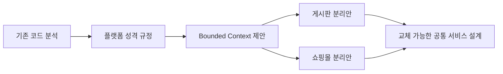
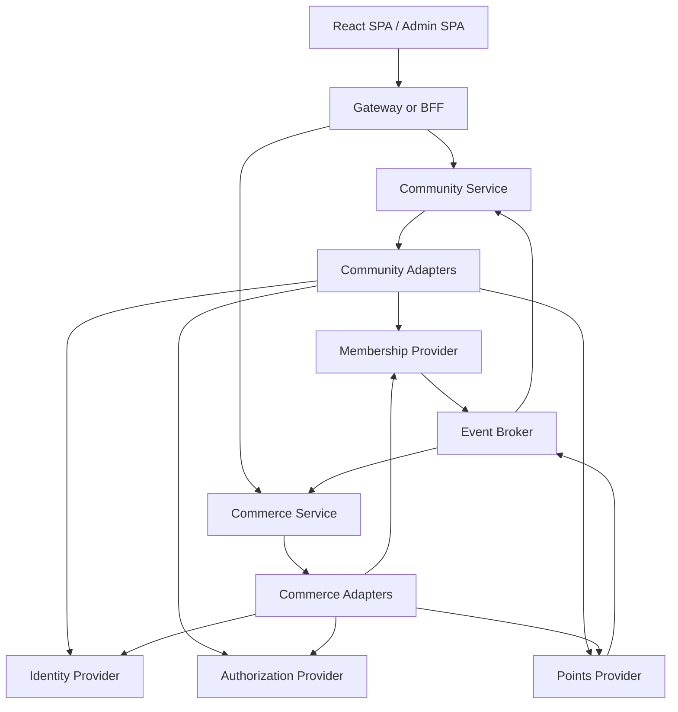

# Modern BBS 조사 문서 인덱스

## 목적

그누보드5와 영카트를 React SPA용 REST API 플랫폼으로 재구성하기 위해 조사·설계한 문서의 목록이다.

## 문서 목록

| 문서 | 주제 | 핵심 내용 |
|---|---|---|
| [gnuboard5-member-youngcart-analysis.md](gnuboard5-member-youngcart-analysis.md) | 기존 코드 분석 | 회원 관리, 영카트 구조, 테이블과 실행 흐름, 결합 지점 |
| [gnuboard5-platform-characterization.md](gnuboard5-platform-characterization.md) | 플랫폼 성격 규정 | 그누보드를 회원 기반 게시판·쇼핑몰 플랫폼으로 볼 수 있는지 평가 |
| [bounded-context-proposal.md](bounded-context-proposal.md) | DDD 분리안 | Identity, Membership, Community, Commerce와 지원 context 제안 |
| [community-decoupling-proposal.md](community-decoupling-proposal.md) | 게시판 분리 | 게시판과 회원·권한·설정·포인트의 느슨한 연결 방법 |
| [commerce-core-decoupling-proposal.md](commerce-core-decoupling-proposal.md) | 쇼핑몰 분리 | 쇼핑몰과 회원·권한·설정·포인트의 느슨한 연결 방법 |
| [pluggable-common-services-architecture.md](pluggable-common-services-architecture.md) | 최종 통합 설계 | 독립 게시판·쇼핑몰과 교체 가능한 공통 기능 계약 및 adapter 구조 |
| [service-feature-catalog.md](service-feature-catalog.md) | 기능 카탈로그 | 공통 기능·게시판·영카트의 사용자·관리자 기능과 목표 소유권 |

## 권장 읽기 순서

1. `gnuboard5-member-youngcart-analysis.md`
2. `gnuboard5-platform-characterization.md`
3. `bounded-context-proposal.md`
4. `community-decoupling-proposal.md`
5. `commerce-core-decoupling-proposal.md`
6. `pluggable-common-services-architecture.md`
7. `service-feature-catalog.md`

## 전체 결론

- 그누보드5는 게시판 중심 플랫폼에 회원 관리와 영카트 쇼핑몰이 통합된 구조다.
- 게시판과 영카트의 직접 도메인 결합은 제한적이지만 전역 회원, 권한, 설정, 포인트와 bootstrap에 대한 공유 결합은 강하다.
- 새 플랫폼에서는 Community와 Commerce가 서로 독립된 데이터와 업무 정책을 소유해야 한다.
- `Member`, `Actor`, `Author`, `Customer`와 `PointAccount`를 서로 다른 개념으로 모델링해야 한다.
- 공통 기능을 하나의 거대한 Common Service로 만들지 않는다.
- 인증은 OIDC, 회원은 최소 사실 query와 lifecycle event, 권한은 전역 grant interface, 포인트는 원장과 예약 interface로 연결한다.
- 각 소비 서비스가 port를 소유하고 Gnuboard 또는 외부 시스템용 adapter를 제공한다.
- 서비스 간 데이터베이스 JOIN과 직접 쓰기를 금지하고 projection, snapshot과 integration event를 사용한다.
- 포인트 사용, 결제와 재고 확보는 동기 예약·확정·해제 방식으로 처리한다.
- 포인트 적립과 알림은 outbox/inbox 기반의 idempotent 비동기 처리로 분리한다.
- 초기에는 모듈러 모놀리스로 경계를 확립하고, 독립 배포 가치가 확인된 후 물리적으로 분리한다.

## 목표 구조

## Logseq 사본

Logseq 기본 그래프 `/Users/yoophi/docs/private-zk`에도 다음 구조로 요약본을 저장했다.

- `[[Modern BBS]]`
- `[[Modern BBS/01 Gnuboard5 플랫폼 분석]]`
- `[[Modern BBS/02 Bounded Context 제안]]`
- `[[Modern BBS/03 게시판과 공통 기능 분리]]`
- `[[Modern BBS/04 쇼핑몰과 공통 기능 분리]]`
- `[[Modern BBS/05 교체 가능한 공통 서비스 계약]]`
- `[[Modern BBS/06 공통 기능 게시판 영카트 기능 카탈로그]]`
