# 공통 기능·게시판·영카트 기능 카탈로그

## 1. 목적

그누보드5에 포함된 기능을 `공통 기능`, `게시판`, `영카트(쇼핑몰)`로 분류하고, REST API 기반 새 플랫폼에서 어떤 서비스가 기능과 데이터를 소유할지 정리한다.

이 문서는 다음 두 관점을 함께 제공한다.

- **현재 기능**: `/Users/yoophi/project/ext/gnuboard5` 코드가 제공하는 기능
- **목표 소유권**: 독립된 Community Service와 Commerce Service 및 교체 가능한 공통 서비스에서의 배치

## 2. 분류 원칙

`공통 기능`은 의미가 모호하므로 다음 세 종류로 구분한다.

1. **공통 업무 서비스**
   - 회원·인증·전역 권한·포인트처럼 게시판과 쇼핑몰 모두 사용하는 독립 업무 capability
2. **공통 기술 capability**
   - 알림, 미디어, 보안 검사처럼 여러 서비스가 interface로 사용하는 기술 기능
3. **플랫폼 운영 기능**
   - 사이트 설정, 메뉴, 테마, 콘텐츠, 방문 통계처럼 플랫폼 shell 또는 운영 도구가 소유할 기능

게시판과 쇼핑몰의 업무 규칙은 공통 기능으로 승격하지 않는다. 예를 들어 게시글 수정 권한은 Community, 주문 취소 권한은 Commerce가 소유한다.

## 3. 전체 기능 지도

```mermaid
flowchart TB
    PLATFORM[Modern BBS Platform]

    PLATFORM --> COMMON[Common Capabilities]
    PLATFORM --> COMMUNITY[Community Service]
    PLATFORM --> COMMERCE[Commerce Service]

    COMMON --> IDENTITY[Identity]
    COMMON --> MEMBERSHIP[Membership]
    COMMON --> AUTHZ[Platform Authorization]
    COMMON --> LOYALTY[Points and Loyalty]
    COMMON --> NOTIFY[Notification]
    COMMON --> MEDIA[Media]
    COMMON --> OPS[Platform Operations]

    COMMUNITY --> BOARDS[Boards and Posts]
    COMMUNITY --> INTERACTION[Comments and Reactions]
    COMMUNITY --> MODERATION[Moderation]
    COMMUNITY --> CMESSAGING[Community Messaging]

    COMMERCE --> CATALOG[Catalog]
    COMMERCE --> CART[Cart and Wishlist]
    COMMERCE --> ORDER[Order and Checkout]
    COMMERCE --> PAYMENT[Payment]
    COMMERCE --> INVENTORY[Inventory]
    COMMERCE --> FULFILLMENT[Fulfillment]
    COMMERCE --> PROMOTION[Promotion]
    COMMERCE --> REPORTING[Commerce Reporting]
```



## 4. 공통 기능

### 4.1 Identity — 인증과 보안 주체

| 기능 | 현재 제공 내용 | 목표 interface 또는 책임 |
|---|---|---|
| 로그인 | ID·비밀번호 로그인, 로그인 후 이동 | OIDC/OAuth 기반 인증 후 `Actor` 생성 |
| 로그아웃 | session 종료 | token/session 폐기 |
| session 관리 | 로그인 session, 현재 접속자 | credential 검증과 session lifecycle |
| 비밀번호 찾기 | 메일 인증, 임시 인증, 비밀번호 재설정 | Identity Provider recovery flow |
| 소셜 로그인 | social plugin을 통한 외부 로그인 | 외부 IdP federation |
| MFA·인증 강도 | 현재 제한적 | `Actor.assuranceLevel`로 표현 |
| credential 검증 | cookie와 session 기반 | JWT/JWKS 또는 token introspection |
| service 인증 | 명확히 분리되지 않음 | workload identity 또는 client credential |

현재 근거: `bbs/login.php`, `bbs/login_check.php`, `bbs/logout.php`, `bbs/password_lost*.php`, `bbs/password_reset*.php`, `plugin/social`.

### 4.2 Membership — 회원 lifecycle과 프로필

| 기능 | 현재 제공 내용 | 목표 소유권 |
|---|---|---|
| 회원가입 | 약관 동의, 가입 form과 가입 완료 | Membership |
| 중복 검사 | ID, email, 휴대전화, nickname 검사 | Membership |
| 회원 추천 | 추천인 검사·기록 | Membership 또는 별도 Referral policy |
| 프로필 조회·변경 | 이름, nickname, 연락처 등 | Membership |
| email 인증 | 인증 mail과 완료 처리 | Membership + Notification |
| 본인·성인 인증 | 인증 결과 저장과 갱신 | Membership |
| 회원 상태 | 정상, 차단, 탈퇴 등 | Membership lifecycle |
| 회원 탈퇴 | 탈퇴 처리 | Membership event 발행, 각 서비스 자체 익명화 |
| 관리자 회원 관리 | 회원 검색·등록·수정·삭제·일괄 처리 | Membership Admin |
| 회원 export | Excel 또는 파일 export | Membership Reporting, 개인정보 통제 필요 |

현재 근거: `bbs/register*.php`, `bbs/ajax.mb_*.php`, `bbs/member_cert_refresh*.php`, `bbs/member_leave.php`, `bbs/profile.php`, `adm/member_*.php`.

Membership이 게시글, 장바구니, 쿠폰과 주문을 직접 수정하지 않는다. `MemberSuspended`, `MemberWithdrawn`, `MemberAnonymizationRequested` 같은 event를 발행하고 각 서비스가 자신의 정책을 적용한다.

### 4.3 Platform Authorization — 플랫폼 전역 권한

| 기능 | 현재 제공 내용 | 목표 소유권 |
|---|---|---|
| 회원 레벨 | `mb_level` 숫자 기반 접근 조건 | 업무 의미가 있는 role·entitlement로 변환 |
| 최고 관리자 | 전체 관리 권한 | Platform Authorization |
| 관리자 메뉴 권한 | 메뉴별 읽기·쓰기·삭제 권한 | Platform Authorization grant |
| 그룹·게시판 관리자 | 특정 게시판 범위 관리 | Community resource policy |
| 쇼핑몰 관리자 | 상품·주문·재고 관리 | Commerce resource policy |
| 소유자 권한 | 자신의 글·주문 수정·취소 | 각 서비스 aggregate invariant |
| 권한 감사 | 제한적인 현재 기록 | decision ID와 policy version 감사 |

현재 근거: `adm/auth_*.php`, `auth_check_menu()`, `mb_level` 비교, 그룹·게시판 관리자 설정.

외부 권한 시스템은 플랫폼 role과 grant를 제공할 수 있지만 게시판과 주문의 상태 기반 invariant를 최종 판정하지 않는다.

### 4.4 Points and Loyalty — 포인트 원장

| 기능 | 현재 제공 내용 | 목표 interface 또는 책임 |
|---|---|---|
| 잔액 조회 | 회원 포인트와 거래 합계 조회 | `getBalance()` |
| 내역 조회 | 회원별 포인트 내역 | `listTransactions()` |
| 관리자 조정 | 수동 지급·차감·삭제 | 감사 가능한 `grant`·`reverse` command |
| 게시 활동 적립·차감 | 글·댓글·조회 등 게시판 정책 | Community event 또는 예약 command |
| 구매 사용 | 주문 결제 금액 일부로 사용 | `reserve` → `commit` 또는 `release` |
| 구매 적립 | 주문 완료 후 상품별 적립 | Commerce event 기반 `grant` |
| 취소·반품 회수 | 주문 상태 변경 시 복원·회수 | 원거래 reference 기반 `reverse` |
| 쿠폰 구매 | 포인트를 차감해 쿠폰 발급 | Promotion process + Points 예약 |
| 만료 | 설정에 따른 유효기간 | Points Provider policy |
| 중복 방지 | 관계 table과 설명 기반 방어 | 모든 command의 idempotency key |

현재 근거: `bbs/point.php`, `adm/point_*.php`, 공용 `insert_point()`, `shop/orderformupdate.php`, `shop/orderinquirycancel.php`, `shop/ajax.coupondownload.php`, `lib/shop.lib.php`.

### 4.5 Notification — 메시지 전달

| 기능 | 현재 제공 내용 | 목표 소유권 |
|---|---|---|
| email | 회원 인증, form mail, 게시·주문 알림 | Notification |
| SMS/LMS | 주문·배송·재입고 등 안내 | Notification |
| 대량 mail | 회원 대상 mail 작성·선택·전송 | Campaign 또는 Notification Admin |
| template | PHP include와 설정 기반 문구 | versioned template |
| 발송 재시도 | 호출 위치별로 상이 | Notification retry와 dead letter |
| 수신 거부 | email 수신 중단 | Membership preference + Notification enforcement |

현재 근거: `lib/mailer.lib.php`, `lib/icode.*.lib.php`, `plugin/PHPMailer`, `plugin/sms5`, `adm/mail_*.php`, 주문 mail·SMS include.

게시글·주문 transaction에서는 메시지를 직접 전송하지 않고 outbox event를 기록한다.

### 4.6 Media — 파일과 이미지

| 기능 | 현재 제공 내용 | 목표 소유권 |
|---|---|---|
| file upload | 게시판 첨부와 상품 이미지 | Media 또는 서비스별 upload adapter |
| download | 게시판 첨부 다운로드와 횟수 | Community download policy |
| thumbnail | 게시글·상품 이미지 thumbnail | Media transformation |
| image view | 원본·확대 이미지 표시 | Media delivery |
| editor asset | WYSIWYG editor upload | Media |
| 파일 정리 | 회원·게시판·thumbnail 파일 삭제 | 보존 policy 기반 cleanup |
| asset 검사 | 현재 제한적 | MIME 검증, 악성 파일 검사, 공개 상태 |

현재 근거: `bbs/download.php`, `bbs/view_image.php`, `lib/thumbnail.lib.php`, `lib/editor.lib.php`, `plugin/editor`, 관련 관리자 cleanup 파일.

서비스 record는 물리 경로 대신 `AssetId`를 저장한다. 다운로드 권한과 상품 공개 조건 같은 업무 규칙은 해당 서비스가 유지한다.

### 4.7 보안과 요청 보호

| 기능 | 현재 제공 내용 | 목표 소유권 |
|---|---|---|
| CAPTCHA | KCaptcha, reCAPTCHA | Security adapter |
| CSRF·token | 글쓰기·관리자 action token | 각 HTTP adapter의 request protection |
| HTML 정화 | HTML Purifier와 입력 filter | Content sanitization policy |
| 입력 검증 | 공용 함수와 파일별 validation | 명령 schema + domain invariant |
| rate limit | 명시적 통합 계층 부족 | Gateway 및 서비스별 abuse policy |
| hook | 공용 hook mechanism | 명시적 domain/integration event로 제한 |

현재 근거: `plugin/kcaptcha`, `plugin/recaptcha*`, `plugin/htmlpurifier`, `bbs/*token*.php`, `lib/hook.lib.php`.

### 4.8 플랫폼 설정과 운영

| 기능군 | 현재 제공 기능 | 목표 위치 |
|---|---|---|
| 사이트 설정 | 사이트명, URL, mail, 회원·게시판 공통 옵션 | 작은 Platform Configuration + context별 typed policy |
| 메뉴 | 사용자·관리자 메뉴 편집 | Platform Shell 또는 Client CMS |
| 테마·스킨 | theme 선택, preview, skin 설정 | React SPA design system 또는 Client Configuration |
| 콘텐츠 | 정적 content page 관리 | CMS |
| FAQ | FAQ master와 항목 관리·노출 | Help Center/CMS |
| popup | 새 창·popup 기간과 노출 | Campaign/CMS |
| cache·session 정리 | cache, CAPTCHA, session, thumbnail cleanup | Platform Operations |
| DB upgrade | schema upgrade 실행 | Deployment/Migration tooling |
| 안전 점검 | 환경·설정 점검 | Platform Operations |

현재 근거: `adm/config_form*.php`, `adm/menu_*.php`, `adm/theme*.php`, `adm/content*.php`, `adm/faq*.php`, `adm/newwin*.php`, `adm/*_file_delete.php`, `adm/dbupgrade.php`, `adm/safe_check.php`.

범용 `$config` 또는 `$default`를 그대로 공통 설정 interface로 만들지 않는다. 설정의 의미를 소유하는 서비스에 typed policy로 둔다.

### 4.9 플랫폼 통계와 참여 도구

| 기능군 | 현재 제공 기능 | 목표 위치 |
|---|---|---|
| 방문 통계 | 일·주·월·년, 시간, browser, OS, device, domain | Analytics |
| 현재 접속자 | session·접속 기록 기반 목록 | Presence/Analytics |
| 인기 검색어 | 검색어 순위와 목록 | Search Analytics |
| 설문 | 투표, 결과와 기타 의견 | Community Engagement |
| 공용 검색 | 여러 게시판 검색 | Community Search |

현재 근거: `bbs/current_connect.php`, `bbs/visit_insert.inc.php`, `adm/visit_*.php`, `adm/popular_*.php`, `bbs/poll_*.php`, `adm/poll_*.php`, `bbs/search.php`.

이 기능들은 현재 공통 화면에 있지만 반드시 회원·인증과 같은 공통 업무 서비스로 구현할 필요는 없다.

## 5. 게시판 기능

### 5.1 게시판 구조와 설정

| 기능 | 설명 |
|---|---|
| 게시판 그룹 | 여러 게시판 묶음과 그룹 관리자 |
| 게시판 생성·복사·삭제 | 게시판 schema와 policy 관리 |
| 게시판별 skin | 목록·본문·작성 화면 표시 |
| 접근 조건 | 목록, 읽기, 작성, 댓글, 다운로드 level |
| 게시물 형식 | 일반글, 공지, 비밀글, 답글 |
| 분류 | 게시판 내부 category |
| 페이지·정렬 | 목록 크기, 정렬과 검색 조건 |
| 첨부 policy | 파일 수, 크기, 확장자, 다운로드 조건 |
| 포인트 policy | 글·댓글·조회·다운로드별 포인트 |
| 알림 policy | 관리자·작성자·댓글 알림 |

현재 근거: `adm/board*.php`, `adm/boardgroup*.php`.

### 5.2 게시글

| 기능 | 설명 |
|---|---|
| 목록·상세 조회 | 게시판 목록과 게시글 본문 |
| 작성 | 제목, 내용, 분류, link, file과 option 입력 |
| 수정·삭제 | 작성자·관리자 권한 및 비밀번호 확인 |
| 답글 | 원문 관계와 정렬을 가진 답변 글 |
| 공지 | 게시판 상단 고정 |
| 비밀글 | 작성자·관리자·허용된 관계만 조회 |
| HTML/에디터 | HTML 내용과 editor 지원 |
| 외부 link | link 저장과 이동·click 처리 |
| 첨부 | 업로드, download, 이미지 보기와 횟수 |
| 조회수 | 본문 조회 count |
| 자동 저장 | 작성 중 내용 저장·목록·불러오기·삭제 |
| SNS 공유 | 게시글을 외부 SNS로 공유 |
| RSS | 게시판 feed 제공 |

현재 근거: `bbs/board.php`, `bbs/list.php`, `bbs/view.php`, `bbs/write*.php`, `bbs/delete*.php`, `bbs/link.php`, `bbs/download.php`, `bbs/ajax.autosave*.php`, `bbs/sns_send.php`, `bbs/rss.php`.

### 5.3 댓글과 반응

| 기능 | 설명 |
|---|---|
| 댓글 작성 | 게시글 하위 댓글 작성 |
| 댓글 답변 | 계층형 댓글 또는 답변 |
| 댓글 수정·삭제 | 작성자·관리자 policy 적용 |
| 추천·비추천 | 게시글 반응과 중복 방지 |
| scrap | 회원 개인 북마크와 메모 |
| 새 글 | 여러 게시판의 최근 글·댓글 조회 |

현재 근거: `bbs/view_comment.php`, `bbs/write_comment_update.php`, `bbs/delete_comment.php`, `bbs/good.php`, `bbs/scrap*.php`, `bbs/new*.php`.

### 5.4 검색과 탐색

| 기능 | 설명 |
|---|---|
| 게시판 내 검색 | 제목, 내용, 작성자 등 조건 검색 |
| 통합 검색 | 여러 게시판 게시글 검색 |
| 최신 글 | 그룹·게시판별 최신 content |
| 인기 검색어 | 검색어 집계와 순위 |
| profile 연결 | 작성자 정보 확인 |

새 구조에서 Community Search projection은 Membership 테이블을 JOIN하지 않고 작성자 snapshot을 사용한다.

### 5.5 Moderation과 관리자 기능

| 기능 | 설명 |
|---|---|
| 일괄 처리 | 목록에서 선택 게시글 삭제 등 |
| 이동·복사 | 게시글을 다른 게시판으로 이동 또는 복사 |
| 게시판 관리자 | 게시판·그룹 범위의 관리 권한 |
| 신고·차단 | 새 플랫폼에서 명시적으로 강화할 기능 |
| content 정리 | 오래된 글·첨부와 thumbnail 관리 |
| 작성 통계 | 게시판·회원별 작성량 운영 조회 |

현재 근거: `bbs/board_list_update.php`, `bbs/move*.php`, `bbs/delete_all.php`, `adm/write_count.php`, 게시판 관리자 파일.

### 5.6 Community 인접 기능

| 기능 | 현재 제공 내용 | 권장 소유권 |
|---|---|---|
| 1:1 문의 | 문의 목록·작성·답변·첨부 | Community Support module |
| 쪽지 | 회원 간 쪽지 작성·조회·삭제 | Community Messaging module |
| 설문 | 투표와 결과 | Community Engagement module |
| form mail | 회원에게 이메일 발송 | Community command + Notification |

현재 근거: `bbs/qa*.php`, `bbs/memo*.php`, `bbs/poll*.php`, `bbs/formmail*.php`.

## 6. 영카트(쇼핑몰) 기능

### 6.1 Storefront와 Catalog

| 기능 | 설명 |
|---|---|
| 쇼핑몰 홈 | 추천·인기·최신·할인 상품 등 구성 |
| 카테고리 | 계층형 상품 분류와 카테고리별 목록 |
| 상품 목록 | 유형, 정렬, paging과 list skin |
| 상품 검색 | 검색어와 조건에 따른 상품 검색 |
| 상품 상세 | 가격, 설명, 이미지, 재고, 배송과 구매 조건 표시 |
| option·추가 option | 상품 선택 사양과 가격·재고 |
| 관련 상품 | 상품 간 relation |
| 상품 유형 | 히트, 추천, 신상품, 인기, 할인 등 |
| 이벤트 | 이벤트와 대상 상품 구성 |
| banner | 위치·기간별 banner와 click 집계 |
| 상품 정보 고시 | 품목별 법정 상품 정보 |
| 대형 이미지 | 상품 이미지 확대 보기 |

현재 근거: `shop/index.php`, `shop/category.php`, `shop/list*.php`, `shop/search.php`, `shop/item*.php`, `shop/event.php`, `shop/bannerhit.php`, `adm/shop_admin/category*.php`, `item*.php`, `itemevent*.php`, `banner*.php`.

### 6.2 Cart와 Wishlist

| 기능 | 설명 |
|---|---|
| cart 생성 | 비회원 session cart와 회원 cart |
| line 추가 | 상품, option, 수량과 선택 상태 저장 |
| 수량·option 변경 | cart line 재계산 |
| 선택 주문 | 선택한 line만 checkout으로 이동 |
| cart 정리 | 보존 기간이 지난 항목 삭제 |
| 로그인 후 귀속 | guest cart를 회원 cart로 연결 |
| wishlist | 회원 관심 상품 추가·삭제·목록 |

현재 근거: `shop/cart*.php`, `shop/ajax.action.php`, `lib/shop.cartvalidate.lib.php`, `shop/wishlist.php`, `shop/wishupdate.php`, `adm/shop_admin/wishlist.php`.

새 구조에서는 cart line과 order line을 서로 다른 aggregate record로 분리한다.

### 6.3 Pricing과 Promotion

| 기능 | 설명 |
|---|---|
| 기본 가격 | 상품·option·추가 option 가격 |
| 회원 조건 | 회원 level에 따른 판매 가능 여부 |
| 상품 쿠폰 | 특정 상품 할인 |
| 카테고리 쿠폰 | 분류 대상 할인 |
| 주문 쿠폰 | 주문 전체 할인 |
| 배송비 쿠폰 | 배송비 할인 |
| 쿠폰 zone | 사용자가 발급받을 수 있는 쿠폰 목록 |
| 회원 대상 쿠폰 | 특정 회원·대상 조건의 쿠폰 |
| 포인트 쿠폰 | 포인트를 사용한 쿠폰 발급 |
| 배송비 계산 | 지역, 주문액, 상품 조건에 따른 계산 |
| checkout quote | 현재 코드에는 독립 모델이 약함, 새 구조에서 snapshot으로 도입 |

현재 근거: `shop/coupon*.php`, `shop/order*coupon.php`, `shop/ordersendcost*.php`, `adm/shop_admin/coupon*.php`, 가격·배송 함수.

### 6.4 Checkout와 주문

| 기능 | 설명 |
|---|---|
| 주문서 | 주문자, 수령자, 배송지, memo 입력 |
| 배송지 관리 | 회원 배송지 목록·등록·수정 |
| 금액 검증 | 상품·option·쿠폰·배송·포인트 재계산 |
| 주문 생성 | 주문 번호, line과 주문 snapshot 저장 |
| 주문 조회 | 목록·상세·상태와 결제 정보 확인 |
| 주문 취소 | 사용자 취소와 포인트·재고·결제 보상 |
| 부분 취소 | 관리자 부분 취소 처리 |
| 주문 상태 변경 | 주문·입금·준비·배송·완료 등 lifecycle |
| 중복 주문 방어 | cart와 쿠폰·결제 중복 처리 방어 |
| 주문 mail·SMS | 고객과 관리자 통지 |
| 주문 출력 | 주문서와 배송 관련 출력 |

현재 근거: `shop/orderform*.php`, `shop/orderinquiry*.php`, `shop/orderaddress*.php`, `adm/shop_admin/order*.php`.

### 6.5 Payment

| 기능 | 설명 |
|---|---|
| 결제수단 | 카드, 계좌이체, 가상계좌 등 설정된 수단 |
| PG 연동 | KCP, Inicis, Toss, Nicepay, LG 등 adapter 성격의 include |
| 간편결제 | KakaoPay, NaverPay 등 |
| 승인 결과 | 거래 번호와 승인 정보 저장 |
| 결제 취소 | 주문 실패·취소 시 PG 취소 |
| 현금영수증 | 관련 결제·세금 정보 처리 |
| 개인결제 | 관리자가 만든 별도 결제 요청 |
| 결제 audit | 일부 PG 로그와 조회 |

현재 근거: `shop/settle_*.inc.php`, `shop/cancel_pg.inc.php`, `shop/personalpay*.php`, `shop/taxsave.php`, `adm/shop_admin/inicislog*.php`, `personalpay*.php`.

새 구조에서 Payment는 공급자별 adapter와 idempotent authorize, capture, void, refund interface를 제공한다.

### 6.6 Inventory와 재입고

| 기능 | 설명 |
|---|---|
| 상품 재고 | 상품 단위 재고 수량 |
| option 재고 | option 조합별 재고 |
| 주문 재고 반영 | 주문 상태에 따른 차감·복원 |
| 재고 부족 방어 | 주문 가능 수량 validation |
| 재고 목록·수정 | 관리자 재고 조회와 일괄 변경 |
| 재입고 알림 신청 | 품절 상품의 SMS 신청 |
| 재입고 알림 발송 | 관리자 대상자 조회와 SMS 처리 |

현재 근거: `shop/ajax.orderstock.php`, `shop/itemstocksms*.php`, `adm/shop_admin/itemstock*.php`, `optionstock*.php`.

새 구조에서는 조회 후 차감보다 TTL을 가진 `reserve`, `commit`, `release` 모델을 사용한다.

### 6.7 Fulfillment

| 기능 | 설명 |
|---|---|
| 배송비 | 상품·주문액·지역 기반 배송비 |
| 배송 정보 | 배송 회사, 송장 번호, 배송 시각 |
| 배송 상태 | 준비·배송·완료 상태 전이 |
| 배송 일괄 등록 | Excel 기반 배송 정보 처리 |
| 배송 내역 | 관리자 배송 대상 목록 |
| 반품·취소 이행 | 재고·결제·포인트와 연계한 보상 |

현재 근거: `adm/shop_admin/orderdelivery*.php`, `sendcost*.php`, 주문 상태 관리 코드.

### 6.8 Commerce Engagement

| 기능 | 설명 | 권장 소유권 |
|---|---|---|
| 상품 후기 | 평점·내용 작성, 목록, 관리자 승인·관리 | Commerce Product Review |
| 상품 문의 | 상품별 질문·답변 | Commerce Product Q&A |
| 상품 추천 mail | 다른 사람에게 상품 추천 | Commerce command + Notification |
| 재입고 구독 | 상품 재고 회복 알림 신청 | Inventory + Notification |

현재 근거: `shop/itemuse*.php`, `shop/itemqa*.php`, `shop/itemrecommend*.php`, 관련 관리자 파일.

상품 후기를 범용 게시판 table로 구현하더라도 구매 검증과 평점 집계가 핵심이면 Commerce가 기능을 소유하는 것이 기본 권장안이다.

### 6.9 쇼핑몰 관리자와 Reporting

| 기능 | 설명 |
|---|---|
| 쇼핑몰 설정 | 결제, 배송, 포인트, 상품 표시와 skin 설정 |
| 상품 관리 | 생성·수정·복사·삭제·일괄 변경 |
| Excel 등록 | 상품 대량 등록 |
| 주문 관리 | 검색, 상태 변경, 삭제, 영수증과 배송 처리 |
| 쿠폰 관리 | 생성·대상·zone·발급 관리 |
| 재고 관리 | 상품·option 재고와 재입고 신청 관리 |
| banner·이벤트 | campaign 노출 관리 |
| 판매 순위 | 상품 판매 순위 |
| 매출 통계 | 일·월·년·기간별 매출 집계 |
| 배송비 내역 | 주문별 배송비 조회·수정 |
| wishlist 통계 | 회원 관심 상품 현황 |

현재 근거: `adm/shop_admin/config*.php`, `item*.php`, `order*.php`, `coupon*.php`, `sale1*.php`, `itemsellrank.php`, `sendcost*.php`, `wishlist.php`.

## 7. 기능 소유권 요약

| 기능 | 현재 위치 | 목표 소유자 | 다른 서비스의 사용 방식 |
|---|---|---|---|
| 로그인·session | 공통 BBS | Identity Provider | OIDC/JWT 검증 후 `Actor` |
| 회원 프로필·상태 | 공통 BBS | Membership Provider | 최소 facts query와 lifecycle event |
| 플랫폼 관리자 grant | 공통 관리자 | Authorization Provider | canonical decision interface |
| 게시판 업무 권한 | 공통 level + 게시판 | Community | Community local policy |
| 쇼핑몰 업무 권한 | 공통 level + 쇼핑몰 | Commerce | Commerce local policy |
| 포인트 원장 | 회원·공용 함수 | Points Provider | query, reserve, commit, release, grant, reverse |
| 게시판·글·댓글 | BBS | Community | Community REST interface와 event |
| 상품·cart·주문 | Youngcart | Commerce | Commerce REST interface와 event |
| 상품 후기·문의 | Youngcart | Commerce | Commerce 내부 module |
| 1:1 문의·쪽지 | BBS | Community 인접 module | Community REST interface |
| email·SMS | 공용 plugin + 각 도메인 | Notification | outbox event |
| 이미지·파일 | 공용 lib + 각 도메인 | Media + 도메인 접근 policy | `AssetId`와 asset event |
| 사이트 content·FAQ | 공통 관리자 | CMS/Help Center | 공개 content query |
| 방문·검색 통계 | 공통 관리자 | Analytics | 비동기 event |
| theme·skin | 공통·각 도메인 | React SPA/Design System | client build/configuration |

## 8. 외부에 제공할 Interface 요약

### 공통 서비스

```text
Identity
  verifyCredential() -> Actor

Membership
  getMemberFacts() -> MemberFacts
  publish MemberLifecycleEvent

Authorization
  authorize() -> Decision
  authorizeBatch() -> Decisions

Points
  getBalance()
  reservePoints()
  commitReservation()
  releaseReservation()
  grantPoints()
  reverseTransaction()
```

### Community Service

```text
Boards
  listBoards(), getBoard()

Posts
  listPosts(), getPost(), createPost(), revisePost(), deletePost()
  movePosts(), copyPosts()

Comments
  createComment(), reviseComment(), deleteComment()

Interactions
  reactToPost(), scrapPost()

Moderation
  moderatePost(), manageBoardPolicy()
```

### Commerce Service

```text
Catalog
  listCategories(), searchItems(), getItem()

Cart
  createCart(), addLine(), changeLine(), removeLine(), claimGuestCart()

Pricing
  createCheckoutQuote(), issueCoupon()

Orders
  submitOrder(), getOrder(), requestCancellation(), requestReturn()

Payments
  authorize(), capture(), void(), refund()

Inventory
  reserve(), commit(), release(), adjust()

Fulfillment
  prepareShipment(), dispatch(), confirmDelivery()
```

위 목록은 기능 지도이며 실제 공개 HTTP endpoint와 내부 module interface를 반드시 동일하게 만들 필요는 없다. 작은 application interface가 validation, 정책 판정, idempotency와 실패 복구를 내부에 숨겨야 한다.

## 9. 서비스별 독립성 검사

### Community Service

- Commerce가 중단돼도 게시판 목록·읽기·작성·moderation을 수행할 수 있어야 한다.
- 상품 후기를 Community가 소유하기로 한 경우에만 구매 자격 확인용 작은 port를 추가한다.
- 포인트 적립 장애가 게시글 transaction을 취소하지 않아야 한다.

### Commerce Service

- Community가 중단돼도 상품 검색, cart, 주문, 결제와 배송을 수행할 수 있어야 한다.
- 회원 탈퇴 후에도 주문 snapshot으로 배송·환불을 처리할 수 있어야 한다.
- 포인트 공급자가 중단되면 포인트 사용만 안전하게 중단하고 비포인트 주문은 계속할 수 있어야 한다.

### 공통 서비스

- Membership이 Community 또는 Commerce table을 직접 수정하지 않아야 한다.
- Authorization Provider가 게시글·주문의 상태 invariant를 소유하지 않아야 한다.
- Points Provider는 업무 발생 이유를 canonical reference로 기록하지만 게시글·주문 schema를 알지 않아야 한다.

## 10. 구현 우선순위

1. `Actor`, `MemberFacts`, `Authorization Decision`, `PointTransaction`의 canonical 용어와 계약 확정
2. 기존 session, `g5_member`, `mb_level`, `g5_point`를 감싸는 legacy adapter 구현
3. Community와 Commerce 데이터베이스와 repository 쓰기 소유권 분리
4. 회원 직접 JOIN을 서비스별 projection으로 교체
5. 포인트 사용의 예약·확정·해제와 포인트 적립 outbox 도입
6. 알림과 미디어를 명시적 interface로 격리
7. CMS, Analytics와 Client Configuration을 핵심 공통 업무 서비스에서 분리
8. 외부 공급자 conformance test와 교체 시나리오 검증

## 11. 관련 문서

- [research-index.md](research-index.md)
- [gnuboard5-member-youngcart-analysis.md](gnuboard5-member-youngcart-analysis.md)
- [bounded-context-proposal.md](bounded-context-proposal.md)
- [community-decoupling-proposal.md](community-decoupling-proposal.md)
- [commerce-core-decoupling-proposal.md](commerce-core-decoupling-proposal.md)
- [pluggable-common-services-architecture.md](pluggable-common-services-architecture.md)

